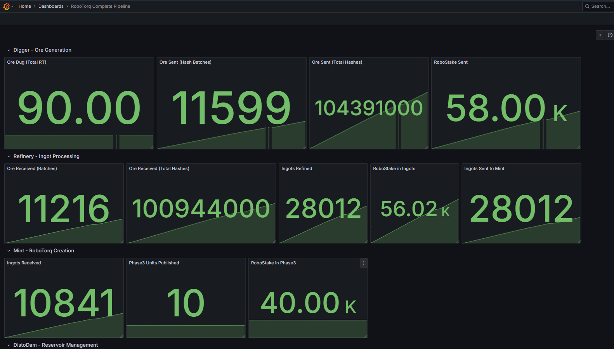

# The RoboTorq Reserve System Paper
*Author*: Jonathan Clark

The RoboTorq Reserve System is an open source, decentralized, Universal Basic Dividend-Paying monetary system.

## What is RoboTorq?

A deterministic, physics-backed reserve currency generated from cryptographically verified robotic labor, without blockchain mining or speculative inflation. Minted and traded digitally initially, RoboTorq Bearer Bonds can be redeemed physically from any 3D printer.

[](./LICENSE)
[](https://www.docker.com/)


---

## Executive TL;DR
- Not a cryptocurrency: no mining, no gas, no chain bloat.
- 1 RoboTorq = 1 kWh x 1 token/second = 1 *thermodynamically ideal* hour of cryptographically proven robotic labor (imagine an economic Carnot Heat Engine in modern robotic form)
- Proof chain compresses raw token x energy "ore" data → ingots → certificates.
- Demurrage (hoarding fee) drives circulation + funds new robotic labor to make new currency.
- One command to run: `docker compose up -d`.
- Everything merklized & signed at multiple layers.

The RoboTorq Reserve System circulates a hard currency in a closed-loop economy. The self-regulating system is designed such that the collateral can, mathematically speaking, never run dry... but only so long as people choose to keep using it.

How? Every atomic investment in robotic labor creates more RoboTorq, bounded by the laws of physics. The closed loop design + contract approval vault check + demurrage ensures the `StakeVault` never accepts a contract it can't fund.

---

## TOC

- [Philosophy](#philosophy)
- [Why No Blockchain?](#why-no-blockchain)
- [Unit Hierarchy](#unit-hierarchy)
- [Quick Start](#quick-start)
- [Testing](#testing)
- [Architecture Overview](#architecture-overview)
- [Project Structure](#project-structure)
- [Development Workflow](#development-workflow)
- [Architecture Deep Dives](#architecture-deep-dives)
- [Contributing](#contributing)
- [Security](#security)
- [License](#license)
- [Status](#status)
- [Contact](#contact)

---

## Philosophy

*"Watts > Wall Street"*

RoboTorq challenges three assumptions:
- Money must be state-issued
- Mining must waste energy
- Value must be speculative

Instead, RoboTorq anchors value to *measurable physics* — actual energy and computation consumed by contracted robotic labor. Each unit is minted only after the work is performed, priced in advance, and cryptographically proven.

Every RoboTorq corresponds to real, verifiable work. This is not “blockchain because blockchain” (there is no blockchain). 

It’s a reserve system where robotic labor produces tangible, auditable, certificate-backed currency and enables universal basic dividends without political inflation games or Wall Street speculation.

Demurrage-free savings and investment schemas ensure liquidity, while demurrage on idle wallets yields interest to savers and funds Robotic Labor. All Bearer Bonds are demurrage exempt and can be printed at home because printing does not equal minting in the RoboTorq Reserve System.

## Why No Blockchain?

RoboTorq uses a lightweight, message-passing network (NATS) and vaulted certificate-backed proofs instead of global consensus.
- Certificates remain inside distributed vaults
- All vaulted artifacts are signed, merklized, and linked
- No mining, no gas, no chain bloat, no global ledger

The core system is intentionally compact — with each service designed to eventually run on a small cluster of Raspberry Pis + minimal storage if need be — so communities with limited resources could hypothetically operate local reserve system nodes on the same footing as anyone else.

Any productive machine (3D printers, CNCs, Cricuts, etc.) can act as a tracked robot, creating a low-barrier, closed-loop economy. If participants choose to use it, the system can sustain itself mathematically through continuous, provable robotic labor rather than speculative growth.

---

## Unit Hierarchy
| Layer | Artifact | Aggregation | Resulting Count | Crypto Operation | Role |
|-------|----------|-------------|-----------------|------------------|------|
| L0 | JouleTorqOre | 1 token × 1 joule | 3,600 per ingot | Raw Data Hashed + Signed | Atomic work proof |
| L1 | TokenTorqIngot | 3,600 units of Ore | 1,000 per certificate | Merkle branch root + Signed | Batched for minting |
| L2 | RoboTorq Certificate | 1,000 ingots (3.6M units of Ore) | Basis for reserve | Merkle batch root + Signed | Monetary Backing |
| L3 | RoboTorqUnits | Certificate-Backed, Digital, 1:1 | Dynamic | Signed Distribution Events | Circulation |
| L4 | Bearer Bond | Certificate-Backed, Physical, 1:1 | Dynamic | Merkle Cert Collection + Signed | Circulation |

Formula relationships:
`1 TokenTorqIngot = 3,600 JouleTorqOre units`
`1 RoboTorq Certificate = 1,000 ingots = 3,600,000 Ore units`

Extended economic flow & vault mechanics: see [`docs/ECONOMICS_OVERVIEW.md`](./docs/ECONOMICS_OVERVIEW.md).


---

## Quick Start

```bash
git clone https://github.com/GrokkingGrok/robotorq-reserve-system.git
cd robotorq-reserve-system
docker compose up -d
docker compose ps            # all services “healthy”
python ./tests/integration/hardware/test_printer_flow.py
# open browser to http://localhost:3001/ for Grafana metric Dashboard
```

**Monitoring**: 
- Grafana http://localhost:3001 (admin/admin) ⚠️ **Local dev only** — change password before exposing to network
- Grafana/robotorq-complete-pipeline.json (fully configured pipeline viewer definition)




**Logs**: 
```bash
# docker native log reader, follow stream
docker compose logs -f mint 

# check scripts/logs folder for helpful python log checkers if you don't want to learn docker logging

# View last 20 lines, no follow
python scripts/logs/mintlogs.py 
# View last N lines only, no follow
python scripts/logs/mintlogs.py --tail 100
# Follow logs in real-time (skip initial tail, stream continuously)
python scripts/logs/mintlogs.py -f
```


**Stop**:
```bash
docker compose down
docker compose down -v   # full reset
```

---

## Prerequisites

- **Git** to clone repo
- **Docker** (with Docker Compose V2) to run nodes
- **Python** for testing

That's it. Everything runs in containers.

## Testing

### Unit Tests (Go)
```bash
# Run all Go tests with coverage
cd src/mint  # or refinery, digger, etc.
go test ./... -v -cover -race
```

---

### Integration Tests (Python)

```bash
cd tests
pytest integration/ -v
```

### End-to-End Tests (Python)
```bash
cd tests
python e2e/phase5_verification_flow.py
```

**Test Documentation**: See [`tests/README.md`](./tests/README.md)

---

## Architecture Overview

RoboTorq uses a **message-passing architecture** (NATS pub/sub) with services that aggregate proofs:

**Key Services**:
- **Digger**: Tracks contracted robotic labor, measures energy, creates signed proof units of Ore
- **Refinery**: Aggregates 3,600 proof units into ingots with merkle branch hashes
- **Mint**: Validates 1,000 ingots, builds merkle tree, mints 1 RoboTorq unit
- **DistoDam** – Distributor + proto-Vault (will be replaced by full Vault)
- **Wallet**: Manages balances, transactions, and unit verification
- **Printer**: (aka a productive robot) track a mock printer as a test robot

Note on "printer" module: 3D-printers are considered robots by this system. The current Mock Printer setup allows you to generate ore for the pipeline. Printer logic will soon involve printing physical RoboTorq as well.


---

## Companion Simulator Repo
The RoboTorq Reserve System is designed (not yet immplemented, see [research\SIMULATION_FRAMEWORK.md](research\SIMULATION_FRAMEWORK.md)) to run simulations on production code by scaling the waits that slow down Digger contract execution logic to be "real-tme".

This planned academic-grade simulator will require minimal refactoring, and will be the primary focus after the first physical Bearer Bond RoboTorq prototype has been printed and tagged. Current expected delivery of first scannable, physical RoboTorq prototype in January-February 2026 (hardware integration, unknown landmines exist).

The simulator configuration logic will live under a different repo and a GPL license: [Project Asimov](https://github.com/GrokkingGrok/Project-Asimov)

---

### High-Level Flow

`Robot → Digger → Refinery → Mint → DistoDam → Wallet`

---

## Project Structure

```
robotorq-reserve-system/
├── src/
│   ├── bidnet/         # Rust: (future) Bid on Robotic Labor Projects or exchange currency
│   ├── digger/         # Rust: Track Robotic Labor/Generates Ore
│   ├── refinery/       # Go: Ore aggregation into ingots
│   ├── mint/           # Go: Ingot validation + RoboTorq minting
│   ├── distodam/       # Go: Distribution with demurrage
│   ├── wallet/         # Go: Balance + transaction management
│   ├── printer/        # Go: A Mock 3D printer to act as robot's labor for tracking, will also print RoboTorq
│   ├── trust/          # Go: Contract Execution
│   └── vault/          # Architecture docs for reserve system (planned)
├── tests/
│   ├── e2e/            # End-to-end pipeline tests
│   ├── integration/    # Service integration tests
│   └── fixtures/       # Shared test helpers
├── scripts/            # Python utilities for testing/monitoring
├── docs/               # Architecture and phase completion docs
├── Grafana/            # Monitoring dashboards
├── docker-compose.yaml # Complete service orchestration
├── MENTAL_MODEL.md     # Conceptual architecture guide
├── BRANCHING.md        # Git workflow and development process
└── LICENSE             # Apache 2.0 with patent pledge
```

---

## Development Workflow

See [`BRANCHING.md`](./BRANCHING.md) for the complete development workflow, including:
- Branch strategy (feature branches from `main`)
- Commit conventions (Conventional Commits)
- Testing requirements (95%+ coverage target)
- The proven 14-step Power Workflow

**Quick Summary**:
1. Create feature branch: `git checkout -b feature/your-feature`
2. Read relevant architecture docs in `src/{service}/`
3. Implement with tests (Go: `go test ./...`, Python: `pytest`)
4. Commit incrementally with descriptive messages
5. Open PR to `main` when ready

---

## Architecture Deep Dives

- **Mental Model**: [`MENTAL_MODEL.md`](./MENTAL_MODEL.md) - Start here for conceptual understanding
- **Proof Chain**: [`docs/PROOF_CHAIN_ARCHITECTURE.md`](./docs/PROOF_CHAIN_ARCHITECTURE.md)
- **Mint**: [`src/mint/MINT_ARCHITECTURE.md`](./src/mint/MINT_ARCHITECTURE.md)
- **Refinery**: [`src/refinery/REFINERY_ARCHITECTURE.md`](./src/refinery/REFINERY_ARCHITECTURE.md)
- **Vault Design**: [`src/vault/Architecture/Final design/VAULT_MVP_FINAL_DESIGN.md`](./src/vault/Architecture/Final%20design/VAULT_MVP_FINAL_DESIGN.md)
- **Trust Economics**: [`docs/trust-economics.md`](./docs/trust-economics.md)

---

## Contributing

Contributions welcome (and needed)! Please see [`CONTRIBUTING.md`](./CONTRIBUTING.md) for guidelines.

**Key Points**:
- Follow the Power Workflow in `BRANCHING.md`
- Write tests (80%+ unit coverage target, cover remaining with integration and e2e)
- Use Conventional Commits format
- Update architecture docs when changing designs

---

## Security

For security concerns or vulnerability reports, see [`SECURITY.md`](./SECURITY.md).

**Current Status**: Pre-release development on `release/v0-cleanup` branch. Not production-ready.

---

## License

Apache License 2.0 with Patent Pledge - see [`LICENSE`](./LICENSE) for details.

**Patent Pledge**: All contributors irrevocably dedicate patent rights to the public domain and pledge not to assert patent claims against users or derivatives.


---

## Status

The RoboTorq Reserve System has been designed and built up to release by the author alone.

This isn't a "flex": the author can't proceed too much further without expert help.

**Current Phase**: v0 Cleanup & Open Source Preparation  
**Branch**: `release/v0`  
**Target**: Public release with working crypto pipeline, extensive documentation, and observability.

**What Works**:
- Complete proof chain (Robot → Digger → Refinery → Mint → DistoDam)
- Prometheus + Grafana observability (Watch the crypto pipeline in action)
- Basic labor tracking
- Cryptographic signing
- Merkle tree aggregation at all layers (except physical bearer bond merkles, depends on vault)
- Persistance of some data
- Wallet recieves UBD, but cannot spend

**In Progress**:
- In-Flight mint ingot recovery backend implemented, needs integration
- Vault System fully designed, but not implemented, will be rust
- DistoDam will be replaced by Vault logic
- Mock-Printer to Real 3D Printer (aka robot)
- Comprehensive documentation
- Simulator configuration design


**Effectively Blocked**:
- Security audit and hardening (high priority, expert needed)
- Trust service needs full rewrite, rust preferred (Executes Contracts, needs vault first)
- BidNet (invest in robotic labor projects, needs vault first) not started, but high-level design known.
- Horizontal scaling (distributed systems experts needed)
- Build/dependency improvements (experts needed)

---

## Contact

- **Repository**: https://github.com/GrokkingGrok/robotorq-reserve-system
- **Issues**: https://github.com/GrokkingGrok/robotorq-reserve-system/issues

---

**Minted with ⚡ by bots, for humans**