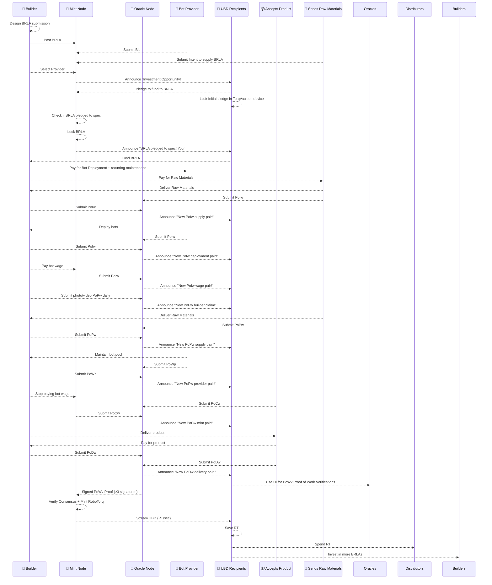
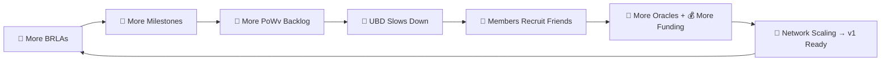
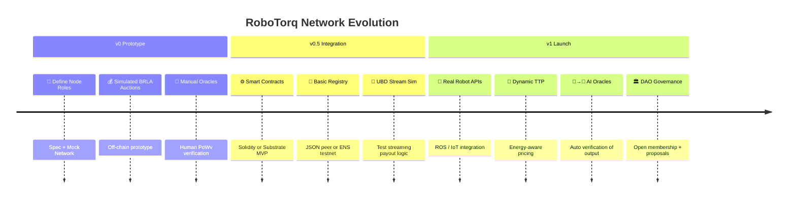

Version: v0.1 Design Doc for p2p bot work share program
Status: Open Spec
License: CC-BY-SA 4.0

# 🤖 b2b (bot2builder): The b2b Bot Work Share Network

The goal of **v0 of the RoboTorq Economy** is to create a **peer-to-peer (p2p)** network connecting bot owners and maintainers with businesses that want robotic labor — without the hassle of ownership and fleet maintenance.

The network will utilize a compact version of the **bond network** conceptualized by _“The RoboTorq Paper: Watts > Wall Street”_.

An **open-source network** will coordinate funding, bidding, and execution of **b2b smart contracts** for robotic labor.  

---

## 🏗️ Core Concept

Here is an example flow for a mass production run.

Similar workflows can be developed for, say, a bot that works at a banana stand.

Abbreviations:
- Proof of Initiated Work PoIw
- Proof of Progressing Work PoPw
- Proof of Completed Work PoCw
- Proof of Delivered Work PoDw
- Proof of Work Verification PoPv




**Highlights:**
- Consensus threshold (≥3 oracle signatures) ensures no minting without verified output.
- The entire flow can be simulated in v0 using mocked proof data.

---

## 💰 Pricing Bids for Robotic Labor

Bid pricing has three components.
- Maintenance Bids determine part of the **contract cost**,
- while the **hourly robotic labor rate** (in tokens per second) defines another part — effectively pegging hourly labor cost (and the value of the RoboTorq) to energy and token throughput.
- An initial stake on the tokens will be calculated based on the risk factor of the builder, supplier, and bot providers.

---

## 📏 Standardizing TTP

Every brand/model of bot is registered under an assigned **TTP (TokenTorq  Potential)** to preserve RoboTorq value.

| Parameter | Value | Description |
|------------|--------|-------------|
| Token Rate | 100 tokens/sec | Base rate for initial bots |
| Energy Draw | 2 kWh | Consumption baseline |
| TTP Rating | 200 | Standardized labor capacity |

This allows a **standardized cost of robotic labor**, where:
- Builders are charged for **Tokentorq capacity**, and  
- Minting happens naturally, taking **opportunity cost** into account.

---

## 🧠 Verification Layer

Oracle nodes hold **proof-of-work submissions** like:
- Proof of Work Initiated PoWi
- Proof of Work Progressing PoWp
- Proof of Work Completed PoWc
- Proof of Work Delivery PoWd

Then, Investors have to verify the work.
- Proof of Work Verification PoWv

**RoboTorq minting** only occurs after oracle verifications are approved.

Members of the network earn **continuous RoboTorq dividends** — but must ensure PoWv backlogs remain low.  
High backlogs = slower UBD (Universal Basic Dividends).  

---

## 🧩 System Architecture — “The Three-Node Network”

```mermaid
graph TD
    %% --- Human & External Actors ---
    subgraph Economic Layer
        MW1[👷 Builder Member Wallet]
        MW2[🤖 Provider Member Wallet]
        MW3[👥 Investor Member Wallet]
        SUP[🚚 Supplier]
        DST[📦 Distributor]
    end

    %% --- Core Coordination ---
    subgraph Mint Layer
        MN1[💎 Mint Node  Contracts + Funding + UBD Stream]
        MN2[💎 Mint Node  Registry / Auction Host]
    end

    %% --- Verification & Proofs ---
    subgraph Oracle Layer
        ON1[🧠 Oracle Node PoWi]
        ON2[🧠 Oracle Node PoWp]
        ON3[🧠 Oracle Node PoWc]
        ON4[🧠 Oracle Node PoWd]
        ON5[🧠 Oracle Node PoWv]
    end

    %% --- Builder & Provider Interaction ---
    MW1 -- "📄 Post BRLA / Request Work" --> MN1
    MW2 -- "💼 Bid Bot Hours / SLA" --> MN1
    MW3 -- "💰 Pledge DistoStream / Fund BRLA" --> MN1

    %% --- Supplier & Distributor Data Feeds ---
    SUP -- "📦 Raw Material Shipment" --> MW1
    SUP -- "🚚 Progress Proof (PoPw)" --> ON1
    DST -- "✅ Delivery Receipt (PoCw)" --> ON3

    %% --- Mint & Oracle Coordination ---
    MN1 -- "🔍 Send PoWv / PoDw / PoCw Requests" --> ON1
    MN1 -- "🔍 Send Verification Requests" --> ON2
    MN1 -- "🔍 Send Verification Requests" --> ON3
    MN1 -- "🔍 Send Verification Requests" --> ON4
    ON1 -- "🧾 Verified Proofs" --> MN1
    ON2 -- "🧾 Verified Proofs" --> MN1
    ON3 -- "🧾 Verified Proofs" --> MN1
    ON4 -- "🧾 Signed PoWv Consensus (≥3 sigs)" --> MN1

    %% --- Minting and Distribution ---
    MN1 -- "🪙 Mint RoboTorq" --> MN1
    MN1 -- "💧 Stream UBD (RT/sec)" --> MW1
    MN1 -- "💧 Stream UBD (RT/sec)" --> MW2
    MN1 -- "💧 Stream UBD (RT/sec)" --> MW3

    %% --- Registry Syncs ---
    MN2 -- "📚 Sync Registry + Bids" --> MN1
    ON1 -- "📡 Pull Registry / Members" --> MN2
    ON2 -- "📡 Pull Registry / Members" --> MN2
    ON3 -- "📡 Pull Registry / Members" --> MN2
    ON4 -- "📡 Pull Registry / Members" --> MN2

```




**Interpretation:**
- Member Wallets handle all human-facing activity (posting jobs, bidding, staking, receiving UBD).
- Mint Nodes coordinate the economy and issue RoboTorq only after verified work.
- Oracle Nodes validate the physical or off-chain output and gate minting.

## 🔗 Three Node Types

### Mint Node
| #  | Function                           | Description                                                                       | Required? | Failure Impact                           |
| -- | ---------------------------------- | --------------------------------------------------------------------------------- | --------- | ---------------------------------------- |
| 1  | **Host BRLA Auction**              | Accept BRLA from builder; collect provider bids + member pledges                  | ✅         | No new work contracts                    |
| 2  | **Select Winning Bid**             | Auto-select lowest cost + highest SLA, or allow builder override                  | ✅         | Poor match between provider and project  |
| 3  | **Lock Contract**                  | Freeze provider hours, escrow pledged RT, record supplier/distributor commitments | ✅         | Double-spend or underfunding risk        |
| 4  | **Track BRLA Lifecycle**           | Manage contract status: Open → Active → Completed → Mintable                      | ✅         | Stalled jobs / mis-synced states         |
| 5  | **Receive Proof Bundles**          | Accept PoPw (progress), PoDw (delivery), PoCw (completion) from oracles           | ✅         | Mint halted; work cannot be verified     |
| 6  | **Lead PoWv Consensus**            | Request ≥3 oracle signatures for verification bundle                              | ✅         | Slower or blocked mint cycle             |
| 7  | **Validate Multi-Proof Consensus** | Check alignment between PoPw, PoDw, PoCw before approval                          | ✅         | Risk of false minting / invalid proofs   |
| 8  | **Mint RoboTorq**                  | Execute mint: `RT_out = Torq × RT_in` after ≥3 valid oracle signatures            | ✅         | No token issuance or economic throughput |
| 9  | **Push UBD Stream**                | Stream pro-rata RT/sec to verified members (builders, oracles, investors)         | ✅         | UBD halts or desynchronizes              |
| 10 | **Maintain Registry**              | Store + sync member list, BRLA status, and oracle assignments daily               | ✅         | UBD misrouting / invalid pledges         |
| 11 | **Broadcast Network Events**       | Publish registry updates, mint logs, and auction results                          | ✅         | Network desync / delayed discovery       |
| 12 | **Manage Funding Pools**           | Track DistoStream pledges and route funds to active BRLAs                         | ✅         | Project underfunding / stalled mints     |
| 13 | **Heartbeat / Liveness Proof**     | Publish status ping every 10 min                                                  | ✅         | Node flagged inactive or paused          |


---

### Oracle Node
| #  | Function                              | Description                                                                                 | Required? | Failure Impact                             |
| -- | ------------------------------------- | ------------------------------------------------------------------------------------------- | --------- | ------------------------------------------ |
| 1  | **Receive Proof Requests**            | Accept verification tasks (PoPw, PoDw, PoCw, PoWv) from Mint Node                           | ✅         | No work validated → mint backlog           |
| 2  | **Verify Proof of Progress (PoPw)**   | Check early-stage evidence — raw material receipts, work-in-progress footage, IoT telemetry | ✅         | Builder milestones can’t unlock funding    |
| 3  | **Verify Proof of Delivery (PoDw)**   | Confirm product delivery, packaging data, or transport documentation                        | ✅         | Delivery phase blocked, no payout          |
| 4  | **Verify Proof of Completion (PoCw)** | Validate final delivery acceptance by distributor, completion signatures                    | ✅         | Finished projects won’t mint tokens        |
| 5  | **Aggregate Proofs into PoWv**        | Bundle verified PoPw/PoDw/PoCw into a signed Proof of Work Verification (PoWv)              | ✅         | Mint Node can’t reach consensus            |
| 6  | **Sign and Submit Consensus Proof**   | Provide PQ-secure signature; ≥3 signatures needed for mint approval                         | ✅         | Mint cycle stalls; UBD delays              |
| 7  | **Earn Verification Fee**             | Collect micro-fees (in RT) from demurrage pool for timely validations                       | ✅         | Oracles lose incentive; verification slows |
| 8  | **Human Oversight Interface**         | Allow optional human review or voting for ambiguous proof data                              | Optional  | Automated systems may misclassify          |
| 9  | **Sync with Registry**                | Pull current member, node, and BRLA listings daily                                          | ✅         | Proofs may reference stale or invalid IDs  |
| 10 | **Submit Oracle Health Signal**       | Prove uptime + availability; weighted in Mint Node selection                                | ✅         | Node deprioritized or dropped from quorum  |


---

### Member Wallet

| #  | Function                                           | Description                                                                     | Required? | Failure Impact                                   |
| -- | -------------------------------------------------- | ------------------------------------------------------------------------------- | --------- | ------------------------------------------------ |
| 1  | **Prove Humanity (PoH)**                           | Complete proof-of-humanity to join registry and qualify for UBD                 | ✅         | Wallet excluded from dividend stream             |
| 2  | **Hold Identity Keypair**                          | Maintain DID or PQ identity key; used for registry sync and on-chain signatures | ✅         | Node can’t authenticate or receive UBD           |
| 3  | **Post BRLA (as Builder)**                         | Define robotic labor need: hours, duration, output specs, and funding cap       | ✅         | No new projects initiated                        |
| 4  | **Bid Bot Hours (as Provider)**                    | Offer available robot hours + SLA guarantees; link registered TTP               | ✅         | No supply of robotic labor                       |
| 5  | **Pledge DistoStream (as Investor)**               | Divert % of UBD income toward BRLA funding pool or bond pledges                 | ✅         | Funding shortfall; slower contract execution     |
| 6  | **Stake SLA Bond (as Provider)**                   | Lock RT tokens as uptime guarantee; returned if SLA met                         | ✅         | No provider trust; blocked from bids             |
| 7  | **Participate in Oracle Work (as Human Verifier)** | Optional: review proof data (video, orders) for PoWv consensus                  | Optional  | Slower PoWv verification; UBD slows network-wide |
| 8  | **Receive UBD Stream**                             | Accept continuous RoboTorq income (RT/sec) from Mint Node streams               | ✅         | Loss of passive income                           |
| 9  | **Vote on Governance (v1)**                        | Use wallet-weighted voting for proposals, registry updates, or TTP calibration  | Optional  | Less influence on protocol evolution             |
| 10 | **Sync Registry + Update Metadata**                | Refresh node and member data daily; upload work credentials or bot registry     | ✅         | Wallet drifts from consensus; misrouted payments |

```mermaid
flowchart LR
    MW[👤 Member Wallet] -->|Post BRLA / Bid / Pledge| MN[💎 Mint Node]
    MN -->|Stream UBD RT/sec| MW
    MW -->|Human Verifications| ON[🧠 Oracle Node]
    ON -->|Verified Proofs (PoWv)| MN
    MW -->|Governance Votes + Sync| REG[📜 Registry]
```

---

## 🧩 Node Function Matrix

| Function | Mint Node | Oracle Node | Member Wallet |
|-----------|------------|--------------|----------------|
| Host Auction | ✅ | ❌ | ❌ |
| Bid on Labor | ❌ | ❌ | ✅ |
| Pledge Funding | ❌ | ❌ | ✅ |
| Verify Output | ❌ | ✅ | Optional |
| Mint RT | ✅ | ❌ | ❌ |
| Push UBD | ✅ | ❌ | ❌ |
| Maintain Registry | ✅ | ✅ (sync) | ✅ (sync) |

---

## ⚙️ Invariants

| Rule | Enforced By |
|------|--------------|
| 1 RT = 1 robot-hour | Fixed TTP = 200 |
| No mint without output | Oracle signatures |
| UBD to all humans | Registry + Mint Node push |
| Funding = labor cost | Bondholder pledge |
| Provider owns uptime | SLA in bid |

---

## 🌀 Growth Flywheel



**Explanation:**
- As activity grows, PoWv demand rises → slows rewards → incentivizes onboarding more humans/oracles/funding.
- This self-regulating feedback loop drives organic decentralization and scaling toward v1.

---

## 🗺️ Roadmap to v1




