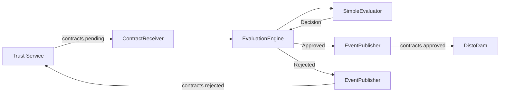

# BidNet Implementation TODO

**Status**: 📋 Phase 1 - MVP Implementation  
**Priority**: High (Blocks DistoDam Refactor)  
**Target**: Modular passthrough evaluation service

---

## 🎯 **MVP Scope & Goals**

### **What BidNet Does (MVP)**
BidNet is the **contract evaluation gateway** between Trust and DistoDam:
- ✅ Receives contract proposals from Trust (`contracts.pending`)
- ✅ Evaluates contracts using pluggable evaluators
- ✅ Publishes approved contracts to DistoDam (`contracts.approved`)
- ✅ Publishes rejected contracts back to Trust (`contracts.rejected`)
- ✅ Provides full observability (Prometheus metrics, structured logging)

### **What BidNet Does NOT Do (MVP)**
- ❌ Currency exchange contracts (RT ↔ USDC) - Phase 2
- ❌ Capability scoring system - Phase 2
- ❌ Gaming resistance algorithms - Phase 2
- ❌ Skill matching system - Phase 2
- ❌ Machine learning models - Phase 2+
- ❌ Complex bid auctions - Phase 2+
- ❌ Historical analytics - Phase 2+

### **Success Criteria**
- ✅ 95%+ test coverage
- ✅ E2E flow: Trust → BidNet → DistoDam → Trust → Executor
- ✅ <10ms evaluation latency (p95)
- ✅ Comprehensive documentation (ARCHITECTURE.md, TESTING_PLAN.md)
- ✅ Docker deployment ready
- ✅ Pluggable evaluator interface (swap algorithms without refactor)

---

## 📐 **Architecture Overview**

### **Component Design** (Follow Mint Pattern)

```
BidNet Service
├── ContractReceiver      (NATS subscriber: contracts.pending)
├── EvaluationEngine      (Orchestrates evaluator pipeline)
├── Evaluators/
│   ├── SimpleEvaluator   (MVP: Basic validation)
│   ├── ROIEvaluator      (Future: ROI-based scoring)
│   └── CompositeEvaluator (Future: Multi-evaluator pipeline)
├── EventPublisher        (NATS publisher: approved/rejected)
├── MetricsCollector      (Prometheus observability)
└── Config                (Environment variables)
```

### **Data Flow**



---

## 📥 **Input: Contract Pending Events**

### **Topic**: `contracts.pending`
**Publisher**: Trust service  
**Subscriber**: BidNet (ContractReceiver)

### **Contract Structure** (Current from Trust)
```go
type Contract struct {
    // Immutable fields (set by Trust or Wallet)
    ID            string  `json:"id"`              // UUID
    Type          string  `json:"type"`            // "production" or "currency_exchange"
    OpportunityID string  `json:"opportunity_id"`  // Source opportunity (production only)
    Builder       string  `json:"builder"`         // Enterprise/builder ID (production only)
    DiggerURL     string  `json:"digger_url"`      // Execution endpoint (production only)
    RoboStake     float64 `json:"robo_stake"`      // RT amount needed
    ROI           float64 `json:"roi"`             // Expected return %
    Torq          int     `json:"torq"`            // Total torque required (production only)
    
    // Mutable fields
    Status string `json:"status"` // "pending" when received
    
    // Timestamps
    CreatedAt   time.Time  `json:"created_at"`
    FundedAt    *time.Time `json:"funded_at,omitempty"`    // Set by DistoDam
    ExecutedAt  *time.Time `json:"executed_at,omitempty"`  // Set by Executor
    CompletedAt *time.Time `json:"completed_at,omitempty"` // Set by Executor
    
    // Legacy fields (ignore for MVP)
    MaxTokenThroughput int `json:"max_token_throughput,omitempty"`
    IntervalSeconds    int `json:"interval_seconds,omitempty"`
    TotalTokens        int `json:"total_tokens,omitempty"`
    
    // Currency exchange fields (Phase 2)
    Exchange *CurrencyExchange `json:"exchange,omitempty"`  // Present when Type == "currency_exchange"
}

// CurrencyExchange represents RT ↔ USDC/fiat exchange details (Phase 2)
type CurrencyExchange struct {
    FromCurrency    string   `json:"from_currency"`     // "RT", "USDC", "USD"
    ToCurrency      string   `json:"to_currency"`       // "RT", "USDC", "USD"
    FromAmount      float64  `json:"from_amount"`       // Amount selling
    ToAmountMin     float64  `json:"to_amount_min"`     // Minimum acceptable (slippage protection)
    PricePerUnit    float64  `json:"price_per_unit"`    // Exchange rate
    PaymentMethods  []string `json:"payment_methods"`   // ["USDC-Ethereum", "USDC-Polygon", "Wire", "Coinbase"]
    SettlementDeadline time.Time `json:"settlement_deadline"` // When trade must complete
    
    // Escrow details
    Escrow *ExchangeEscrow `json:"escrow,omitempty"`
}

type ExchangeEscrow struct {
    RTLocked        float64 `json:"rt_locked,omitempty"`         // RT locked in wallet (if selling RT)
    USDCDeposited   float64 `json:"usdc_deposited,omitempty"`    // USDC in escrow (if buying RT)
    EscrowAddress   string  `json:"escrow_address,omitempty"`    // Smart contract address
    LockedAt        time.Time `json:"locked_at,omitempty"`
}
```

### **Validation on Receive**
```go
func (r *ContractReceiver) ValidateContract(c *Contract) error {
    // Common validation
    if c.ID == "" {
        return errors.New("missing contract ID")
    }
    if c.Status != "pending" {
        return errors.New("invalid status: expected 'pending'")
    }
    if c.CreatedAt.IsZero() {
        return errors.New("missing created_at timestamp")
    }
    
    // Type-specific validation
    switch c.Type {
    case "production":
        return r.validateProductionContract(c)
    case "currency_exchange":
        return r.validateExchangeContract(c)
    default:
        return fmt.Errorf("unknown contract type: %s", c.Type)
    }
}

func (r *ContractReceiver) validateProductionContract(c *Contract) error {
    if c.RoboStake <= 0 {
        return errors.New("invalid robo_stake: must be > 0")
    }
    if c.OpportunityID == "" {
        return errors.New("missing opportunity_id")
    }
    if c.Builder == "" {
        return errors.New("missing builder")
    }
    return nil
}

func (r *ContractReceiver) validateExchangeContract(c *Contract) error {
    if c.Exchange == nil {
        return errors.New("missing exchange details")
    }
    if c.Exchange.FromAmount <= 0 {
        return errors.New("invalid from_amount: must be > 0")
    }
    if c.Exchange.ToAmountMin <= 0 {
        return errors.New("invalid to_amount_min: must be > 0")
    }
    if !isValidCurrency(c.Exchange.FromCurrency) {
        return fmt.Errorf("invalid from_currency: %s", c.Exchange.FromCurrency)
    }
    if !isValidCurrency(c.Exchange.ToCurrency) {
        return fmt.Errorf("invalid to_currency: %s", c.Exchange.ToCurrency)
    }
    if c.Exchange.FromCurrency == c.Exchange.ToCurrency {
        return errors.New("from_currency and to_currency cannot be the same")
    }
    if len(c.Exchange.PaymentMethods) == 0 {
        return errors.New("at least one payment method required")
    }
    if c.Exchange.SettlementDeadline.Before(time.Now()) {
        return errors.New("settlement_deadline must be in the future")
    }
    
    // Validate escrow present
    if c.Exchange.Escrow == nil {
        return errors.New("escrow details required for currency exchange")
    }
    
    // Validate escrow has appropriate funds locked
    if c.Exchange.FromCurrency == "RT" && c.Exchange.Escrow.RTLocked <= 0 {
        return errors.New("RT must be locked in escrow when selling RT")
    }
    if c.Exchange.FromCurrency == "USDC" && c.Exchange.Escrow.USDCDeposited <= 0 {
        return errors.New("USDC must be deposited in escrow when buying RT")
    }
    
    return nil
}

func isValidCurrency(currency string) bool {
    valid := map[string]bool{
        "RT":   true,
        "USDC": true,
        "USD":  true,
    }
    return valid[currency]
}
```

---

## 📤 **Output: Approved/Rejected Events**

### **Topic**: `contracts.approved`
**Publisher**: BidNet (EventPublisher)  
**Subscriber**: DistoDam (ContractFunder)

### **ApprovedContract Structure** (BidNet Output)
```go
type ApprovedContract struct {
    Contract               // Embed original contract
    
    // BidNet additions
    Status       string         `json:"status"`        // "approved"
    ApprovedAt   time.Time      `json:"approved_at"`   // Evaluation timestamp
    ApprovedBy   string         `json:"approved_by"`   // "bidnet-001"
    Evaluation   *BidEvaluation `json:"evaluation"`    // Evaluation scores
}

type BidEvaluation struct {
    // MVP scores
    ROIScore      float64 `json:"roi_score"`       // Contract ROI value
    RiskScore     float64 `json:"risk_score"`      // Risk assessment (0-1)
    FinalScore    float64 `json:"final_score"`     // Composite score
    EvaluatorUsed string  `json:"evaluator_used"`  // "SimpleEvaluator", "ExchangeEvaluator", etc.
    
    // Future scores (set to 0 in MVP)
    CapabilityScore     float64 `json:"capability_score,omitempty"`      // Builder capability (Phase 2)
    GamingResistance    float64 `json:"gaming_resistance,omitempty"`     // Anti-manipulation (Phase 2)
    SkillMatchScore     float64 `json:"skill_match_score,omitempty"`     // Skill matching (Phase 2)
    
    // Exchange-specific scores (Phase 2)
    MarketRateVariance  float64 `json:"market_rate_variance,omitempty"`  // % diff from market rate
    LiquidityScore      float64 `json:"liquidity_score,omitempty"`       // Available liquidity depth
    WalletReputationScore float64 `json:"wallet_reputation_score,omitempty"` // Seller/buyer reputation
}
```

---

### **Topic**: `contracts.rejected`
**Publisher**: BidNet (EventPublisher)  
**Subscriber**: Trust service

### **RejectedContract Structure**
```go
type RejectedContract struct {
    Contract              // Embed original contract
    
    // BidNet additions
    Status      string    `json:"status"`       // "rejected"
    RejectedAt  time.Time `json:"rejected_at"`  // Evaluation timestamp
    RejectedBy  string    `json:"rejected_by"`  // "bidnet-001"
    Reason      string    `json:"reason"`       // Rejection reason code
    Details     string    `json:"details"`      // Human-readable explanation
    Evaluation  *BidEvaluation `json:"evaluation,omitempty"` // Partial scores
}
```

### **Rejection Reasons** (MVP)
```go
const (
    RejectReasonInvalidROI       = "roi_below_threshold"      // ROI < 10%
    RejectReasonInvalidStake     = "invalid_robo_stake"       // RoboStake <= 0
    RejectReasonInvalidStatus    = "invalid_status"           // Status != "pending"
    RejectReasonMissingFields    = "missing_required_fields"  // ID, CreatedAt, etc.
    RejectReasonEvaluationFailed = "evaluation_error"         // Evaluator threw error
)
```

---

## 🏗️ **Component Specifications**

### **1. Config**
**File**: `internal/config/config.go`

**Responsibility**: Load and validate configuration from environment

**Environment Variables**:
```bash
# HTTP server
HTTP_PORT=8083              # Default: "8083" (avoid conflicts)

# NATS connection
NATS_URL=nats://nats:4222   # Default: "nats://nats:4222"

# NATS topics (configurable for testing)
CONTRACTS_PENDING_TOPIC=contracts.pending     # Default
CONTRACTS_APPROVED_TOPIC=contracts.approved   # Default
CONTRACTS_REJECTED_TOPIC=contracts.rejected   # Default

# Evaluation configuration
ROI_THRESHOLD=10.0          # Default: 10.0 (%)
RISK_THRESHOLD=0.7          # Default: 0.7 (max acceptable risk)
EVALUATOR_TYPE=simple       # Default: "simple" (Options: simple, roi, composite)

# Retry configuration
NATS_RETRIES=3              # Default: 3
NATS_BACKOFF_BASE_MS=100    # Default: 100ms

# Logging
LOG_LEVEL=info              # Default: "info" (debug, info, warn, error)

# Identity
BIDNET_ID=bidnet-001        # Default: "bidnet-001"
```

**Validation Rules**:
```go
func (c *Config) Validate() error {
    if c.HTTPPort == "" || !isValidPort(c.HTTPPort) {
        return errors.New("invalid HTTP_PORT")
    }
    if c.NatsURL == "" {
        return errors.New("missing NATS_URL")
    }
    if c.ROIThreshold < 0 {
        return errors.New("ROI_THRESHOLD must be >= 0")
    }
    if c.RiskThreshold < 0 || c.RiskThreshold > 1 {
        return errors.New("RISK_THRESHOLD must be between 0 and 1")
    }
    if !isValidLogLevel(c.LogLevel) {
        return errors.New("invalid LOG_LEVEL")
    }
    return nil
}
```

**Tests** (29 tests like Mint):
- TestConfig_Defaults
- TestConfig_LoadFromEnv
- TestConfig_Validate_ROIThreshold
- TestConfig_Validate_RiskThreshold
- TestConfig_Validate_InvalidPort
- TestConfig_Validate_MissingNatsURL
- TestConfig_String

---

### **2. ContractReceiver**
**File**: `internal/bidnet/contract_receiver.go`

**Responsibility**: Subscribe to `contracts.pending`, validate, forward to EvaluationEngine

**Interface**:
```go
type ContractReceiver interface {
    Start(ctx context.Context) error
    Shutdown() error
    GetStats() ReceiverStats
}

type ReceiverStats struct {
    ContractsReceived int64
    ContractsInvalid  int64
    LastReceivedAt    time.Time
}
```

**Implementation**:
```go
type contractReceiver struct {
    natsConn     *nats.Conn
    topic        string
    engineChan   chan *Contract      // Forward to EvaluationEngine
    ctx          context.Context
    cancel       context.CancelFunc
    metrics      *MetricsCollector
    logger       *slog.Logger
    
    // Stats (atomic)
    received     atomic.Int64
    invalid      atomic.Int64
    lastReceived atomic.Int64  // Unix timestamp
}

func (r *contractReceiver) Start(ctx context.Context) error {
    r.ctx, r.cancel = context.WithCancel(ctx)
    
    _, err := r.natsConn.Subscribe(r.topic, func(msg *nats.Msg) {
        r.handleMessage(msg)
    })
    
    if err != nil {
        return fmt.Errorf("subscribe failed: %w", err)
    }
    
    r.logger.Info("contract_receiver_started", "topic", r.topic)
    return nil
}

func (r *contractReceiver) handleMessage(msg *nats.Msg) {
    r.received.Add(1)
    r.lastReceived.Store(time.Now().Unix())
    r.metrics.ContractsReceivedTotal.Inc()
    
    // Parse contract
    var contract Contract
    if err := json.Unmarshal(msg.Data, &contract); err != nil {
        r.logger.Error("invalid_contract_json", "error", err, "raw", string(msg.Data))
        r.invalid.Add(1)
        r.metrics.ContractsInvalidTotal.Inc()
        return
    }
    
    // Validate contract
    if err := r.validateContract(&contract); err != nil {
        r.logger.Warn("contract_validation_failed",
            "contract_id", contract.ID,
            "error", err)
        r.invalid.Add(1)
        r.metrics.ContractsInvalidTotal.Inc()
        return
    }
    
    // Forward to evaluation engine
    select {
    case r.engineChan <- &contract:
        r.logger.Info("contract_forwarded",
            "contract_id", contract.ID,
            "robo_stake", contract.RoboStake,
            "roi", contract.ROI)
    case <-r.ctx.Done():
        return
    }
}

func (r *contractReceiver) validateContract(c *Contract) error {
    // Same validation as shown in Input section above
}
```

**Tests** (15 tests):
- TestContractReceiver_Start
- TestContractReceiver_ReceiveValidContract
- TestContractReceiver_ReceiveInvalidJSON
- TestContractReceiver_ValidationFailures (7 sub-tests for each field)
- TestContractReceiver_Shutdown
- TestContractReceiver_GetStats
- TestContractReceiver_ConcurrentReceive (100 contracts)

---

### **3. EvaluationEngine**
**File**: `internal/bidnet/evaluation_engine.go`

**Responsibility**: Orchestrate contract evaluation using pluggable evaluators

**Interface**:
```go
type EvaluationEngine interface {
    Start(ctx context.Context) error
    Shutdown() error
    GetStats() EngineStats
}

type EngineStats struct {
    ContractsEvaluated int64
    ContractsApproved  int64
    ContractsRejected  int64
    AverageLatencyMs   float64
}
```

**Implementation**:
```go
type evaluationEngine struct {
    inputChan     <-chan *Contract     // From ContractReceiver
    evaluator     Evaluator            // Pluggable evaluator
    publisher     EventPublisher
    ctx           context.Context
    cancel        context.CancelFunc
    metrics       *MetricsCollector
    logger        *slog.Logger
    bidnetID      string
    
    // Stats
    evaluated     atomic.Int64
    approved      atomic.Int64
    rejected      atomic.Int64
    totalLatency  atomic.Int64  // Microseconds
}

func (e *evaluationEngine) Start(ctx context.Context) error {
    e.ctx, e.cancel = context.WithCancel(ctx)
    
    go e.processLoop()
    
    e.logger.Info("evaluation_engine_started",
        "evaluator", e.evaluator.Name())
    return nil
}

func (e *evaluationEngine) processLoop() {
    for {
        select {
        case contract := <-e.inputChan:
            e.processContract(contract)
        case <-e.ctx.Done():
            return
        }
    }
}

func (e *evaluationEngine) processContract(contract *Contract) {
    start := time.Now()
    e.evaluated.Add(1)
    
    // Run evaluation
    decision, evaluation, err := e.evaluator.Evaluate(contract)
    
    latency := time.Since(start)
    e.totalLatency.Add(latency.Microseconds())
    e.metrics.EvaluationLatency.Observe(latency.Seconds())
    
    if err != nil {
        e.logger.Error("evaluation_failed",
            "contract_id", contract.ID,
            "error", err)
        e.publishRejection(contract, RejectReasonEvaluationFailed, err.Error(), nil)
        return
    }
    
    // Publish based on decision
    if decision == EvaluationApproved {
        e.publishApproval(contract, evaluation)
    } else {
        e.publishRejection(contract, decision.Reason, decision.Details, evaluation)
    }
}

func (e *evaluationEngine) publishApproval(contract *Contract, eval *BidEvaluation) {
    approved := &ApprovedContract{
        Contract:   *contract,
        Status:     "approved",
        ApprovedAt: time.Now(),
        ApprovedBy: e.bidnetID,
        Evaluation: eval,
    }
    
    if err := e.publisher.PublishApproved(approved); err != nil {
        e.logger.Error("publish_approved_failed",
            "contract_id", contract.ID,
            "error", err)
        e.metrics.PublishFailuresTotal.Inc()
        return
    }
    
    e.approved.Add(1)
    e.metrics.ContractsApprovedTotal.Inc()
    e.logger.Info("contract_approved",
        "contract_id", contract.ID,
        "final_score", eval.FinalScore)
}

func (e *evaluationEngine) publishRejection(contract *Contract, reason, details string, eval *BidEvaluation) {
    rejected := &RejectedContract{
        Contract:   *contract,
        Status:     "rejected",
        RejectedAt: time.Now(),
        RejectedBy: e.bidnetID,
        Reason:     reason,
        Details:    details,
        Evaluation: eval,
    }
    
    if err := e.publisher.PublishRejected(rejected); err != nil {
        e.logger.Error("publish_rejected_failed",
            "contract_id", contract.ID,
            "error", err)
        e.metrics.PublishFailuresTotal.Inc()
        return
    }
    
    e.rejected.Add(1)
    e.metrics.ContractsRejectedTotal.Inc()
    e.logger.Warn("contract_rejected",
        "contract_id", contract.ID,
        "reason", reason,
        "details", details)
}
```

**Tests** (12 tests):
- TestEvaluationEngine_Start
- TestEvaluationEngine_ProcessApproval
- TestEvaluationEngine_ProcessRejection
- TestEvaluationEngine_EvaluatorError
- TestEvaluationEngine_PublishFailure
- TestEvaluationEngine_GetStats
- TestEvaluationEngine_Latency
- TestEvaluationEngine_ConcurrentProcessing (100 contracts)
- TestEvaluationEngine_Shutdown

---

### **4. Evaluator Interface** (Pluggable)
**File**: `internal/bidnet/evaluator.go`

**Interface** (Pluggable Design):
```go
type Evaluator interface {
    // Name returns the evaluator identifier
    Name() string
    
    // Evaluate returns decision and evaluation scores
    Evaluate(contract *Contract) (EvaluationDecision, *BidEvaluation, error)
}

type EvaluationDecision int

const (
    EvaluationApproved EvaluationDecision = iota
    EvaluationRejected
)

func (d EvaluationDecision) Reason string
func (d EvaluationDecision) Details string
```

---

### **5. SimpleEvaluator** (MVP Implementation)
**File**: `internal/bidnet/simple_evaluator.go`

**Responsibility**: Basic validation - ROI threshold, stake > 0

**Implementation**:
```go
type SimpleEvaluator struct {
    roiThreshold  float64  // From config (default: 10.0)
    riskThreshold float64  // From config (default: 0.7)
}

func NewSimpleEvaluator(roiThreshold, riskThreshold float64) *SimpleEvaluator {
    return &SimpleEvaluator{
        roiThreshold:  roiThreshold,
        riskThreshold: riskThreshold,
    }
}

func (e *SimpleEvaluator) Name() string {
    return "SimpleEvaluator"
}

func (e *SimpleEvaluator) Evaluate(contract *Contract) (EvaluationDecision, *BidEvaluation, error) {
    evaluation := &BidEvaluation{
        ROIScore:      contract.ROI,
        EvaluatorUsed: e.Name(),
    }
    
    // Check ROI threshold
    if contract.ROI < e.roiThreshold {
        return EvaluationDecision{
            Result:  EvaluationRejected,
            Reason:  RejectReasonInvalidROI,
            Details: fmt.Sprintf("ROI %.2f%% below threshold %.2f%%", 
                                 contract.ROI, e.roiThreshold),
        }, evaluation, nil
    }
    
    // Calculate simple risk score (inverse of ROI for MVP)
    // Higher ROI = lower risk
    // Risk = 1 - (ROI / 100)  where ROI in percentage
    evaluation.RiskScore = 1.0 - (contract.ROI / 100.0)
    if evaluation.RiskScore < 0 {
        evaluation.RiskScore = 0
    }
    
    // Check risk threshold
    if evaluation.RiskScore > e.riskThreshold {
        return EvaluationDecision{
            Result:  EvaluationRejected,
            Reason:  "risk_too_high",
            Details: fmt.Sprintf("Risk %.2f exceeds threshold %.2f", 
                                 evaluation.RiskScore, e.riskThreshold),
        }, evaluation, nil
    }
    
    // Calculate final score (simple average for MVP)
    // Final = ROI score (normalized to 0-1)
    evaluation.FinalScore = contract.ROI / 100.0
    if evaluation.FinalScore > 1.0 {
        evaluation.FinalScore = 1.0
    }
    
    return EvaluationDecision{
        Result: EvaluationApproved,
    }, evaluation, nil
}
```

**Tests** (10 tests):
- TestSimpleEvaluator_Name
- TestSimpleEvaluator_ApproveValidContract
- TestSimpleEvaluator_RejectLowROI
- TestSimpleEvaluator_RejectHighRisk
- TestSimpleEvaluator_ROIThreshold (boundary testing)
- TestSimpleEvaluator_RiskScoreCalculation
- TestSimpleEvaluator_FinalScoreCalculation
- TestSimpleEvaluator_EdgeCases (0 ROI, 100% ROI, negative ROI)

---

### **6. ExchangeEvaluator** (Phase 2 - Currency Exchange Contracts)
**File**: `internal/bidnet/exchange_evaluator.go`

**Responsibility**: Evaluate RT ↔ USDC/fiat exchange contracts

**Purpose**: 
- Check exchange rate against current market rate
- Assess wallet reputation (prevent scammers)
- Verify liquidity availability (can BidNet fill this order?)
- Detect manipulation attempts (wash trading, price pumping)

**Implementation** (Phase 2):
```go
type ExchangeEvaluator struct {
    marketRateFetcher  MarketRateFetcher   // Get current RT/USDC rate
    reputationChecker  ReputationChecker   // Check wallet history
    liquidityPool      LiquidityPool       // BidNet's RT/USDC reserves
    maxPriceVariance   float64             // Max acceptable % diff from market (e.g., 5%)
    minReputationScore float64             // Minimum wallet reputation (e.g., 4.0/5.0)
}

func NewExchangeEvaluator(config *ExchangeConfig) *ExchangeEvaluator {
    return &ExchangeEvaluator{
        marketRateFetcher:  NewMarketRateFetcher(),
        reputationChecker:  NewReputationChecker(),
        liquidityPool:      NewLiquidityPool(),
        maxPriceVariance:   config.MaxPriceVariance,
        minReputationScore: config.MinReputationScore,
    }
}

func (e *ExchangeEvaluator) Name() string {
    return "ExchangeEvaluator"
}

func (e *ExchangeEvaluator) Evaluate(contract *Contract) (EvaluationDecision, *BidEvaluation, error) {
    if contract.Type != "currency_exchange" {
        return EvaluationDecision{}, nil, errors.New("wrong contract type - expected currency_exchange")
    }
    
    exchange := contract.Exchange
    evaluation := &BidEvaluation{
        EvaluatorUsed: e.Name(),
    }
    
    // 1. Fetch current market rate
    marketRate, err := e.marketRateFetcher.GetRate(exchange.FromCurrency, exchange.ToCurrency)
    if err != nil {
        return EvaluationDecision{}, nil, fmt.Errorf("market rate fetch failed: %w", err)
    }
    
    // 2. Calculate variance from market
    variance := (exchange.PricePerUnit - marketRate) / marketRate * 100.0  // % difference
    evaluation.MarketRateVariance = variance
    
    // 3. Reject if price too far from market (manipulation risk)
    if math.Abs(variance) > e.maxPriceVariance {
        return EvaluationDecision{
            Result:  EvaluationRejected,
            Reason:  "price_variance_too_high",
            Details: fmt.Sprintf("Price variance %.2f%% exceeds threshold %.2f%%", 
                                 variance, e.maxPriceVariance),
        }, evaluation, nil
    }
    
    // 4. Check wallet reputation
    reputation, err := e.reputationChecker.GetScore(contract.Builder)  // Builder = wallet ID
    if err != nil {
        return EvaluationDecision{}, nil, fmt.Errorf("reputation check failed: %w", err)
    }
    evaluation.WalletReputationScore = reputation.AverageRating
    
    if reputation.AverageRating < e.minReputationScore {
        return EvaluationDecision{
            Result:  EvaluationRejected,
            Reason:  "low_wallet_reputation",
            Details: fmt.Sprintf("Wallet reputation %.2f below threshold %.2f", 
                                 reputation.AverageRating, e.minReputationScore),
        }, evaluation, nil
    }
    
    // 5. Check liquidity availability
    availableLiquidity := e.liquidityPool.GetAvailable(exchange.ToCurrency)
    evaluation.LiquidityScore = availableLiquidity / exchange.ToAmountMin  // Ratio: available / needed
    
    if availableLiquidity < exchange.ToAmountMin {
        // Not enough liquidity to fill order
        // Option A: Reject
        // Option B: Partial fill (implement in Phase 3)
        return EvaluationDecision{
            Result:  EvaluationRejected,
            Reason:  "insufficient_liquidity",
            Details: fmt.Sprintf("Liquidity %.2f %s < required %.2f %s", 
                                 availableLiquidity, exchange.ToCurrency,
                                 exchange.ToAmountMin, exchange.ToCurrency),
        }, evaluation, nil
    }
    
    // 6. Calculate risk score
    // Lower variance = lower risk
    // Higher reputation = lower risk
    evaluation.RiskScore = (math.Abs(variance) / e.maxPriceVariance) * 0.5 +
                          (1.0 - reputation.AverageRating / 5.0) * 0.5
    
    // 7. Calculate final score
    // Higher liquidity = better score
    // Lower variance = better score
    evaluation.FinalScore = (1.0 - math.Abs(variance) / e.maxPriceVariance) * 0.5 +
                           (evaluation.LiquidityScore) * 0.5
    if evaluation.FinalScore > 1.0 {
        evaluation.FinalScore = 1.0
    }
    
    return EvaluationDecision{
        Result: EvaluationApproved,
    }, evaluation, nil
}
```

**Supporting Types** (Phase 2):
```go
// MarketRateFetcher gets current exchange rates
type MarketRateFetcher interface {
    GetRate(from, to string) (float64, error)
}

// ReputationChecker gets wallet reputation
type ReputationChecker interface {
    GetScore(walletID string) (*ReputationScore, error)
}

type ReputationScore struct {
    WalletID      string
    TotalTrades   int
    SuccessRate   float64  // 0.0 - 1.0
    AverageRating float64  // 0.0 - 5.0
}

// LiquidityPool manages BidNet's RT/USDC reserves
type LiquidityPool interface {
    GetAvailable(currency string) float64
    LockFunds(currency string, amount float64) error
    ReleaseFunds(currency string, amount float64) error
}
```

**Tests** (15 tests - Phase 2):
- TestExchangeEvaluator_Name
- TestExchangeEvaluator_ApproveValidExchange
- TestExchangeEvaluator_RejectHighPriceVariance
- TestExchangeEvaluator_RejectLowVariance (too good = manipulation)
- TestExchangeEvaluator_RejectLowReputation
- TestExchangeEvaluator_RejectInsufficientLiquidity
- TestExchangeEvaluator_MarketRateFetchError
- TestExchangeEvaluator_ReputationCheckError
- TestExchangeEvaluator_RiskScoreCalculation
- TestExchangeEvaluator_FinalScoreCalculation
- TestExchangeEvaluator_WrongContractType
- TestExchangeEvaluator_EdgeCases

**Note**: This is a **Phase 2 feature**. For MVP, exchange contracts will be rejected with:
```go
if contract.Type == "currency_exchange" {
    return EvaluationDecision{
        Result:  EvaluationRejected,
        Reason:  "feature_not_implemented",
        Details: "Currency exchange contracts not supported in MVP",
    }, nil, nil
}
```

---

### **7. ROIEvaluator** (Phase 2 - Interface Only for MVP)
**File**: `internal/bidnet/roi_evaluator.go`

**Purpose**: More sophisticated ROI-based scoring (implement later)

**Stub**:
```go
type ROIEvaluator struct {
    // TODO: Implement in Phase 2
    // - Historical ROI tracking
    // - Builder reputation scoring
    // - Industry benchmarks
}

func (e *ROIEvaluator) Name() string {
    return "ROIEvaluator"
}

func (e *ROIEvaluator) Evaluate(contract *Contract) (EvaluationDecision, *BidEvaluation, error) {
    return EvaluationDecision{}, nil, errors.New("not implemented - use SimpleEvaluator")
}
```

---

### **8. EventPublisher**
**File**: `internal/bidnet/event_publisher.go`

**Responsibility**: Publish approved/rejected contracts to NATS

**Interface**:
```go
type EventPublisher interface {
    PublishApproved(contract *ApprovedContract) error
    PublishRejected(contract *RejectedContract) error
    Close() error
}
```

**Implementation**:
```go
type eventPublisher struct {
    natsConn        *nats.Conn
    approvedTopic   string
    rejectedTopic   string
    retries         int
    backoffBase     time.Duration
    metrics         *MetricsCollector
    logger          *slog.Logger
}

func (p *eventPublisher) PublishApproved(contract *ApprovedContract) error {
    data, err := json.Marshal(contract)
    if err != nil {
        return fmt.Errorf("marshal failed: %w", err)
    }
    
    return p.publishWithRetry(p.approvedTopic, data, "approved", contract.ID)
}

func (p *eventPublisher) PublishRejected(contract *RejectedContract) error {
    data, err := json.Marshal(contract)
    if err != nil {
        return fmt.Errorf("marshal failed: %w", err)
    }
    
    return p.publishWithRetry(p.rejectedTopic, data, "rejected", contract.ID)
}

func (p *eventPublisher) publishWithRetry(topic string, data []byte, eventType, contractID string) error {
    var lastErr error
    
    for attempt := 0; attempt <= p.retries; attempt++ {
        if attempt > 0 {
            // Exponential backoff
            backoff := p.backoffBase * time.Duration(1<<uint(attempt-1))
            time.Sleep(backoff)
            p.metrics.PublishRetriesTotal.Inc()
            p.logger.Warn("publish_retry",
                "attempt", attempt,
                "contract_id", contractID,
                "backoff_ms", backoff.Milliseconds())
        }
        
        err := p.natsConn.Publish(topic, data)
        if err == nil {
            p.metrics.PublishSuccessTotal.Inc()
            p.logger.Info("published",
                "topic", topic,
                "event_type", eventType,
                "contract_id", contractID)
            return nil
        }
        
        lastErr = err
        p.logger.Error("publish_failed",
            "attempt", attempt,
            "contract_id", contractID,
            "error", err)
    }
    
    p.metrics.PublishFailuresTotal.Inc()
    return fmt.Errorf("publish failed after %d retries: %w", p.retries, lastErr)
}
```

**Tests** (10 tests):
- TestEventPublisher_PublishApproved
- TestEventPublisher_PublishRejected
- TestEventPublisher_MarshalError
- TestEventPublisher_PublishError
- TestEventPublisher_RetrySuccess
- TestEventPublisher_RetryExhausted
- TestEventPublisher_ConcurrentPublish

---

### **9. MetricsCollector**
**File**: `internal/bidnet/metrics.go`

**Responsibility**: Prometheus metrics for observability

**Metrics**:
```go
type MetricsCollector struct {
    // Contract reception
    ContractsReceivedTotal prometheus.Counter
    ContractsInvalidTotal  prometheus.Counter
    
    // Evaluation
    ContractsEvaluatedTotal prometheus.Counter
    ContractsApprovedTotal  prometheus.Counter
    ContractsRejectedTotal  prometheus.Counter
    EvaluationLatency       prometheus.Histogram
    
    // Rejection reasons
    RejectionsROITotal      prometheus.Counter
    RejectionsRiskTotal     prometheus.Counter
    RejectionsInvalidTotal  prometheus.Counter
    
    // Publishing
    PublishSuccessTotal     prometheus.Counter
    PublishFailuresTotal    prometheus.Counter
    PublishRetriesTotal     prometheus.Counter
    
    // Evaluator-specific
    EvaluatorType           prometheus.Gauge  // 0=simple, 1=roi, 2=composite
}

func NewMetricsCollector() *MetricsCollector {
    m := &MetricsCollector{
        ContractsReceivedTotal: prometheus.NewCounter(prometheus.CounterOpts{
            Name: "bidnet_contracts_received_total",
            Help: "Total number of contracts received from Trust",
        }),
        // ... (all metrics initialized similarly)
        EvaluationLatency: prometheus.NewHistogram(prometheus.HistogramOpts{
            Name:    "bidnet_evaluation_latency_seconds",
            Help:    "Contract evaluation latency in seconds",
            Buckets: []float64{0.001, 0.005, 0.01, 0.025, 0.05, 0.1, 0.25, 0.5, 1.0},
        }),
    }
    
    // Register all metrics
    prometheus.MustRegister(
        m.ContractsReceivedTotal,
        m.ContractsInvalidTotal,
        // ... (register all)
    )
    
    return m
}
```

---

## 🧪 **Testing Strategy**

### **Unit Tests** (Component Isolation)
**Target**: 95%+ code coverage

**Files**:
- `config_test.go` (29 tests) - Config loading, validation
- `contract_receiver_test.go` (15 tests) - NATS subscription, validation
- `evaluation_engine_test.go` (12 tests) - Orchestration, error handling
- `simple_evaluator_test.go` (10 tests) - Evaluation logic
- `event_publisher_test.go` (10 tests) - NATS publishing, retries

**Run**:
```bash
go test ./internal/config -v
go test ./internal/bidnet -v
```

---

### **Integration Tests** (Embedded NATS)
**File**: `internal/bidnet/integration_test.go`

**Test**: Full pipeline with embedded NATS server
```go
func TestBidNet_Integration(t *testing.T) {
    // 1. Start embedded NATS server
    natsServer := natstest.RunServer(&natstest.DefaultTestOptions)
    defer natsServer.Shutdown()
    
    // 2. Initialize all components
    config := &Config{...}
    receiver := NewContractReceiver(...)
    engine := NewEvaluationEngine(...)
    publisher := NewEventPublisher(...)
    
    // 3. Start components
    receiver.Start(ctx)
    engine.Start(ctx)
    
    // 4. Subscribe to output topics
    approvedCh := make(chan *ApprovedContract, 10)
    rejectedCh := make(chan *RejectedContract, 10)
    
    nc.Subscribe("contracts.approved", func(msg *nats.Msg) {
        var approved ApprovedContract
        json.Unmarshal(msg.Data, &approved)
        approvedCh <- &approved
    })
    
    nc.Subscribe("contracts.rejected", func(msg *nats.Msg) {
        var rejected RejectedContract
        json.Unmarshal(msg.Data, &rejected)
        rejectedCh <- &rejected
    })
    
    // 5. Publish test contracts
    publishTestContract(nc, "contract-1", 15.0) // Should approve
    publishTestContract(nc, "contract-2", 5.0)  // Should reject (ROI < 10%)
    
    // 6. Verify results
    select {
    case approved := <-approvedCh:
        assert.Equal(t, "contract-1", approved.ID)
        assert.Equal(t, "approved", approved.Status)
        assert.Greater(t, approved.Evaluation.FinalScore, 0.0)
    case <-time.After(5 * time.Second):
        t.Fatal("timeout waiting for approval")
    }
    
    select {
    case rejected := <-rejectedCh:
        assert.Equal(t, "contract-2", rejected.ID)
        assert.Equal(t, "rejected", rejected.Status)
        assert.Equal(t, RejectReasonInvalidROI, rejected.Reason)
    case <-time.After(5 * time.Second):
        t.Fatal("timeout waiting for rejection")
    }
}
```

**Run**:
```bash
go test ./internal/bidnet -run Integration -v
```

---

### **Benchmark Tests**
**File**: `internal/bidnet/benchmark_test.go`

**Benchmarks**:
```go
func BenchmarkSimpleEvaluator_Evaluate(b *testing.B) {
    evaluator := NewSimpleEvaluator(10.0, 0.7)
    contract := &Contract{
        ID:        "bench-contract",
        RoboStake: 0.05,
        ROI:       15.0,
        Status:    "pending",
    }
    
    b.ResetTimer()
    for i := 0; i < b.N; i++ {
        evaluator.Evaluate(contract)
    }
}

func BenchmarkEvaluationEngine_Throughput(b *testing.B) {
    // Measure contracts/sec
}
```

**Run**:
```bash
go test -bench=. -benchmem ./internal/bidnet
```

**Target**: >100,000 evaluations/sec

---

## 🚀 **Main Service Orchestration**

### **File**: `cmd/bidnet/main.go`

**Responsibilities**:
- Load configuration
- Initialize all components
- Wire components together
- Start HTTP server (health, metrics, status)
- Start NATS subscribers and publishers
- Graceful shutdown on SIGINT/SIGTERM

**Implementation**:
```go
package main

import (
    "context"
    "log/slog"
    "net/http"
    "os"
    "os/signal"
    "syscall"
    
    "b2b/bidnet/internal/bidnet"
    "b2b/bidnet/internal/config"
    
    "github.com/nats-io/nats.go"
    "github.com/prometheus/client_golang/prometheus/promhttp"
)

func main() {
    // Initialize structured logging
    slog.SetDefault(slog.New(slog.NewJSONHandler(os.Stdout, &slog.HandlerOptions{
        Level: slog.LevelInfo,
    })))
    
    // Load configuration
    cfg, err := config.Load()
    if err != nil {
        slog.Error("config_load_failed", "error", err)
        os.Exit(1)
    }
    
    if err := cfg.Validate(); err != nil {
        slog.Error("config_invalid", "error", err)
        os.Exit(1)
    }
    
    slog.Info("config_loaded", "config", cfg.String())
    
    // Connect to NATS
    nc, err := nats.Connect(cfg.NatsURL)
    if err != nil {
        slog.Error("nats_connect_failed", "error", err)
        os.Exit(1)
    }
    defer nc.Close()
    
    slog.Info("nats_connected", "url", cfg.NatsURL)
    
    // Initialize components
    metrics := bidnet.NewMetricsCollector()
    
    evaluator := createEvaluator(cfg)
    publisher := bidnet.NewEventPublisher(nc, cfg, metrics)
    
    engineChan := make(chan *bidnet.Contract, 100)
    receiver := bidnet.NewContractReceiver(nc, cfg, engineChan, metrics)
    engine := bidnet.NewEvaluationEngine(engineChan, evaluator, publisher, cfg, metrics)
    
    // Context for graceful shutdown
    ctx, cancel := signal.NotifyContext(context.Background(), 
        syscall.SIGINT, syscall.SIGTERM)
    defer cancel()
    
    // Start components
    if err := receiver.Start(ctx); err != nil {
        slog.Error("receiver_start_failed", "error", err)
        os.Exit(1)
    }
    
    if err := engine.Start(ctx); err != nil {
        slog.Error("engine_start_failed", "error", err)
        os.Exit(1)
    }
    
    // Start HTTP server
    startHTTPServer(cfg, receiver, engine)
    
    slog.Info("bidnet_running",
        "http_port", cfg.HTTPPort,
        "evaluator", evaluator.Name(),
        "roi_threshold", cfg.ROIThreshold)
    
    // Block until shutdown signal
    <-ctx.Done()
    
    // Graceful shutdown
    slog.Info("shutdown_initiated")
    receiver.Shutdown()
    engine.Shutdown()
    nc.Flush()
    
    slog.Info("bidnet_exited_cleanly")
}

func createEvaluator(cfg *config.Config) bidnet.Evaluator {
    switch cfg.EvaluatorType {
    case "simple":
        return bidnet.NewSimpleEvaluator(cfg.ROIThreshold, cfg.RiskThreshold)
    case "roi":
        // Future: return bidnet.NewROIEvaluator(...)
        slog.Warn("roi_evaluator_not_implemented", "falling_back", "simple")
        return bidnet.NewSimpleEvaluator(cfg.ROIThreshold, cfg.RiskThreshold)
    default:
        slog.Warn("unknown_evaluator_type", "type", cfg.EvaluatorType, "using", "simple")
        return bidnet.NewSimpleEvaluator(cfg.ROIThreshold, cfg.RiskThreshold)
    }
}

func startHTTPServer(cfg *config.Config, receiver bidnet.ContractReceiver, engine bidnet.EvaluationEngine) {
    mux := http.NewServeMux()
    
    // Health check
    mux.HandleFunc("/health", func(w http.ResponseWriter, r *http.Request) {
        w.Write([]byte("OK"))
    })
    
    // Status endpoint
    mux.HandleFunc("/status", func(w http.ResponseWriter, r *http.Request) {
        receiverStats := receiver.GetStats()
        engineStats := engine.GetStats()
        
        status := map[string]interface{}{
            "bidnet_id": cfg.BidnetID,
            "evaluator": cfg.EvaluatorType,
            "receiver": map[string]interface{}{
                "contracts_received": receiverStats.ContractsReceived,
                "contracts_invalid":  receiverStats.ContractsInvalid,
                "last_received_at":   receiverStats.LastReceivedAt,
            },
            "engine": map[string]interface{}{
                "contracts_evaluated": engineStats.ContractsEvaluated,
                "contracts_approved":  engineStats.ContractsApproved,
                "contracts_rejected":  engineStats.ContractsRejected,
                "avg_latency_ms":      engineStats.AverageLatencyMs,
            },
        }
        
        w.Header().Set("Content-Type", "application/json")
        json.NewEncoder(w).Encode(status)
    })
    
    // Prometheus metrics
    mux.Handle("/metrics", promhttp.Handler())
    
    // Start server in background
    go func() {
        addr := ":" + cfg.HTTPPort
        slog.Info("http_server_listening", "addr", addr)
        if err := http.ListenAndServe(addr, mux); err != nil {
            slog.Error("http_server_error", "error", err)
        }
    }()
}
```

---

## 🐳 **Docker Deployment**

### **Dockerfile**
**File**: `src/bidnet/Dockerfile`

```dockerfile
# Multi-stage build (follow Mint pattern)
FROM golang:1.24-alpine AS builder

WORKDIR /app

# Copy go.mod and go.sum
COPY go.mod go.sum ./
RUN go mod download

# Copy source code
COPY . .

# Build binary
RUN CGO_ENABLED=0 GOOS=linux go build -o bidnet ./cmd/bidnet

# Production image
FROM alpine:3.20

# Install ca-certificates for HTTPS
RUN apk --no-cache add ca-certificates

WORKDIR /root/

# Copy binary from builder
COPY --from=builder /app/bidnet .

# Expose HTTP port
EXPOSE 8083

# Health check
HEALTHCHECK --interval=30s --timeout=3s --start-period=5s --retries=3 \
    CMD wget -qO- http://localhost:8083/health || exit 1

# Run service
CMD ["./bidnet"]
```

**Build**:
```bash
docker build -t bidnet:latest .
```

---

### **docker-compose.yaml** (Add BidNet Service)
**File**: `robotorq-network/docker-compose.yaml`

```yaml
services:
  # ... existing services (nats, trust, mint, distodam, etc.)
  
  bidnet:
    build:
      context: ./src/bidnet
      dockerfile: Dockerfile
    container_name: robotorq-network-bidnet-1
    ports:
      - "8083:8083"
    environment:
      HTTP_PORT: "8083"
      NATS_URL: "nats://nats:4222"
      CONTRACTS_PENDING_TOPIC: "contracts.pending"
      CONTRACTS_APPROVED_TOPIC: "contracts.approved"
      CONTRACTS_REJECTED_TOPIC: "contracts.rejected"
      ROI_THRESHOLD: "10.0"
      RISK_THRESHOLD: "0.7"
      EVALUATOR_TYPE: "simple"
      NATS_RETRIES: "3"
      NATS_BACKOFF_BASE_MS: "100"
      LOG_LEVEL: "info"
      BIDNET_ID: "bidnet-001"
    depends_on:
      - nats
    networks:
      - robotorq-network
    healthcheck:
      test: ["CMD", "wget", "-qO-", "http://localhost:8083/health"]
      interval: 30s
      timeout: 3s
      retries: 3
      start_period: 5s

networks:
  robotorq-network:
    driver: bridge
```

**Start**:
```bash
docker-compose up -d bidnet
```

---

## 🧪 **E2E Testing**

### **Test Script**: `test-e2e-bidnet.ps1`
**File**: `robotorq-network/test-e2e-bidnet.ps1`

```powershell
#!/usr/bin/env pwsh
# E2E test for BidNet integration

Write-Host "═══════════════════════════════════════════" -ForegroundColor Cyan
Write-Host "  BidNet E2E Integration Test" -ForegroundColor Cyan
Write-Host "═══════════════════════════════════════════" -ForegroundColor Cyan

# Step 1: Verify services running
Write-Host "`n[Step 1] Verifying services..." -ForegroundColor Yellow

$services = @{
    "NATS"    = "http://localhost:4222"
    "Trust"   = "http://localhost:9000/health"
    "BidNet"  = "http://localhost:8083/health"
    "DistoDam" = "http://localhost:8082/health"
}

foreach ($name in $services.Keys) {
    try {
        $response = Invoke-WebRequest -Uri $services[$name] -TimeoutSec 3 -UseBasicParsing
        Write-Host "  ✅ $name is running" -ForegroundColor Green
    } catch {
        Write-Host "  ❌ $name is not responding" -ForegroundColor Red
        exit 1
    }
}

# Step 2: Create opportunity (Trust will create contract)
Write-Host "`n[Step 2] Creating opportunity in Trust..." -ForegroundColor Yellow

$opportunity = @{
    id = "opp-bidnet-test-001"
    builder = "enterprise-test"
    digger_url = "http://localhost:8081/contracts"
    expected_cost = 100.0
    expected_sale = 115.0  # 15% ROI (should approve)
    joules_required = 3600
} | ConvertTo-Json

try {
    $response = Invoke-RestMethod -Uri "http://localhost:9000/opportunities" `
        -Method Post `
        -ContentType "application/json" `
        -Body $opportunity `
        -TimeoutSec 5
    
    Write-Host "  ✅ Opportunity created: $($response.id)" -ForegroundColor Green
} catch {
    Write-Host "  ❌ Failed to create opportunity: $_" -ForegroundColor Red
    exit 1
}

# Step 3: Wait for contract to flow through BidNet
Write-Host "`n[Step 3] Waiting for contract evaluation..." -ForegroundColor Yellow
Start-Sleep -Seconds 2

# Step 4: Check BidNet metrics
Write-Host "`n[Step 4] Checking BidNet metrics..." -ForegroundColor Yellow

try {
    $metrics = Invoke-RestMethod -Uri "http://localhost:8083/metrics" -TimeoutSec 3
    
    if ($metrics -match "bidnet_contracts_received_total (\d+)") {
        $received = [int]$matches[1]
        Write-Host "  📊 Contracts received: $received" -ForegroundColor Cyan
    }
    
    if ($metrics -match "bidnet_contracts_approved_total (\d+)") {
        $approved = [int]$matches[1]
        Write-Host "  ✅ Contracts approved: $approved" -ForegroundColor Green
    }
    
    if ($metrics -match "bidnet_contracts_rejected_total (\d+)") {
        $rejected = [int]$matches[1]
        Write-Host "  ❌ Contracts rejected: $rejected" -ForegroundColor Yellow
    }
} catch {
    Write-Host "  ⚠️  Could not fetch metrics: $_" -ForegroundColor Yellow
}

# Step 5: Check DistoDam received approved contract
Write-Host "`n[Step 5] Checking DistoDam status..." -ForegroundColor Yellow

try {
    $status = Invoke-RestMethod -Uri "http://localhost:8082/status" -TimeoutSec 3
    Write-Host "  📊 DistoDam reservoir: $($status.reservoir) RT" -ForegroundColor Cyan
} catch {
    Write-Host "  ⚠️  Could not fetch DistoDam status: $_" -ForegroundColor Yellow
}

# Step 6: Test rejection (low ROI)
Write-Host "`n[Step 6] Testing contract rejection (low ROI)..." -ForegroundColor Yellow

$lowROIOpportunity = @{
    id = "opp-bidnet-test-002"
    builder = "enterprise-test"
    digger_url = "http://localhost:8081/contracts"
    expected_cost = 100.0
    expected_sale = 105.0  # 5% ROI (should reject - below 10% threshold)
    joules_required = 3600
} | ConvertTo-Json

try {
    $response = Invoke-RestMethod -Uri "http://localhost:9000/opportunities" `
        -Method Post `
        -ContentType "application/json" `
        -Body $lowROIOpportunity `
        -TimeoutSec 5
    
    Write-Host "  ✅ Low ROI opportunity created: $($response.id)" -ForegroundColor Green
} catch {
    Write-Host "  ❌ Failed to create low ROI opportunity: $_" -ForegroundColor Red
}

Start-Sleep -Seconds 2

# Check updated metrics
try {
    $metrics = Invoke-RestMethod -Uri "http://localhost:8083/metrics" -TimeoutSec 3
    
    if ($metrics -match "bidnet_contracts_rejected_total (\d+)") {
        $rejected = [int]$matches[1]
        if ($rejected -gt 0) {
            Write-Host "  ✅ Contract correctly rejected (total: $rejected)" -ForegroundColor Green
        }
    }
} catch {
    Write-Host "  ⚠️  Could not verify rejection: $_" -ForegroundColor Yellow
}

Write-Host "`n═══════════════════════════════════════════" -ForegroundColor Cyan
Write-Host "  ✅ BidNet E2E TEST COMPLETE!" -ForegroundColor Green
Write-Host "═══════════════════════════════════════════" -ForegroundColor Cyan
```

**Run**:
```powershell
.\test-e2e-bidnet.ps1
```

---

## 📚 **Documentation**

### **Files to Create**:

1. ✅ **ARCHITECTURE.md** (600+ lines)
   - System overview
   - Component design (all 8 components)
   - Data flow diagrams
   - NATS integration
   - Evaluator interface and implementations
   - Metrics & observability
   - Configuration reference
   - Deployment guides

2. ✅ **TESTING_PLAN.md** (500+ lines)
   - Test coverage matrix
   - Unit test descriptions
   - Integration test scenarios
   - Benchmark targets
   - E2E test procedures
   - Known issues
   - Future test plans

3. ✅ **README.md** (200 lines)
   - Quick start guide
   - Configuration
   - Running locally
   - Docker deployment
   - Metrics endpoints
   - Troubleshooting

---

## 📋 **Implementation Checklist**

### **Phase 1: Project Setup** (Day 1 Morning)
- [ ] Create `src/bidnet/` directory structure
- [ ] Initialize Go module (`go mod init b2b/bidnet`)
- [ ] Add dependencies (`go.mod`, `go.sum`)
- [ ] Create package structure:
  - `cmd/bidnet/` - Main entry point
  - `internal/config/` - Configuration
  - `internal/bidnet/` - Core components

### **Phase 2: Core Components** (Day 1 Afternoon)
- [ ] Implement `Config` (load, validate, tests)
- [ ] Implement `MetricsCollector` (Prometheus setup)
- [ ] Implement `SimpleEvaluator` (evaluation logic, tests)
- [ ] Implement `EventPublisher` (NATS publishing, retries, tests)

### **Phase 3: Receivers & Engine** (Day 2 Morning)
- [ ] Implement `ContractReceiver` (NATS subscription, validation, tests)
- [ ] Implement `EvaluationEngine` (orchestration, tests)
- [ ] Wire components together

### **Phase 4: Main Orchestration** (Day 2 Afternoon)
- [ ] Implement `main.go` (component wiring, HTTP server)
- [ ] Add graceful shutdown logic
- [ ] Test locally (manual testing)

### **Phase 5: Testing** (Day 3)
- [ ] Write all unit tests (95%+ coverage)
- [ ] Write integration test (embedded NATS)
- [ ] Write benchmark tests
- [ ] Run full test suite
- [ ] Fix any failures

### **Phase 6: Docker & Deployment** (Day 4 Morning)
- [ ] Create `Dockerfile` (multi-stage build)
- [ ] Update `docker-compose.yaml` (add bidnet service)
- [ ] Build Docker image
- [ ] Test Docker deployment
- [ ] Create E2E test script (`test-e2e-bidnet.ps1`)

### **Phase 7: Documentation** (Day 4 Afternoon - Day 5)
- [ ] Write `ARCHITECTURE.md`
- [ ] Write `TESTING_PLAN.md`
- [ ] Write `README.md`
- [ ] Add inline code comments
- [ ] Create diagrams (data flow, component architecture)

### **Phase 8: Integration & Validation** (Day 5)
- [ ] Run E2E test with Trust + BidNet + DistoDam
- [ ] Verify metrics in Prometheus
- [ ] Load testing (1000 contracts/sec)
- [ ] Fix any issues
- [ ] Final cleanup

---

## ✅ **Definition of Done**

- [ ] All 95+ unit tests passing
- [ ] Integration test with embedded NATS passing
- [ ] E2E test script passing (Trust → BidNet → DistoDam)
- [ ] Docker image builds successfully
- [ ] docker-compose service starts and health checks pass
- [ ] Metrics visible in Prometheus
- [ ] Comprehensive documentation (ARCHITECTURE.md, TESTING_PLAN.md, README.md)
- [ ] Code review complete
- [ ] Feature branch merged to MVP

---

## 🚀 **Next Steps After MVP**

### **Phase 2: Currency Exchange Contracts**
- [ ] Implement `ExchangeEvaluator` (rate checking, reputation, liquidity)
- [ ] Add `MarketRateFetcher` (get current RT/USDC rates)
- [ ] Add `ReputationChecker` (wallet trade history)
- [ ] Add `LiquidityPool` (BidNet's RT/USDC reserves)
- [ ] Implement matching engine (match buyers with sellers)
- [ ] Add escrow coordination with Trust Service
- [ ] Write comprehensive tests (15+ tests)

### **Phase 3: Enhanced Evaluators** (Future)
- [ ] Implement `ROIEvaluator` (historical data, benchmarks)
- [ ] Implement `CompositeEvaluator` (multi-evaluator pipeline)
- [ ] Add capability scoring system (builder track record)
- [ ] Add gaming resistance algorithms (detect manipulation)
- [ ] Add skill matching system (match builders to contracts)

### **Phase 4: Advanced Features** (Future)
- [ ] Bid auctions (multiple enterprises competing)
- [ ] Partial order fills (liquidity aggregation)
- [ ] Historical analytics dashboard
- [ ] Machine learning model integration
- [ ] Contract amendments/updates
- [ ] A/B testing for evaluators
- [ ] Cross-currency routing (RT → USDC → EUR, etc.)

---

**Last Updated**: November 14, 2025  
**Author**: GitHub Copilot (with Jon's guidance)  
**Status**: Ready for Implementation  
**Estimated Completion**: 5 days (Nov 19, 2025)
