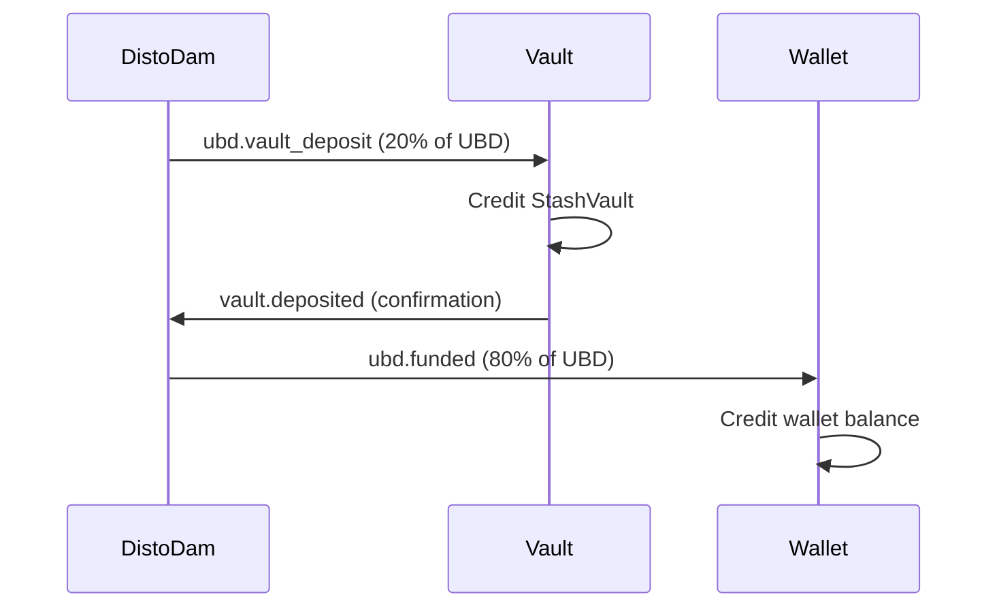
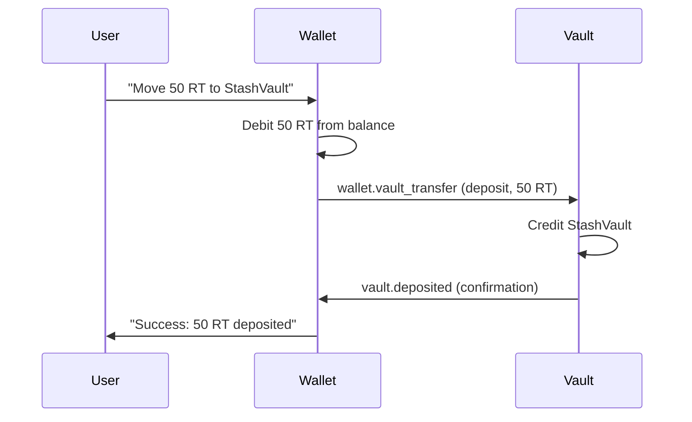
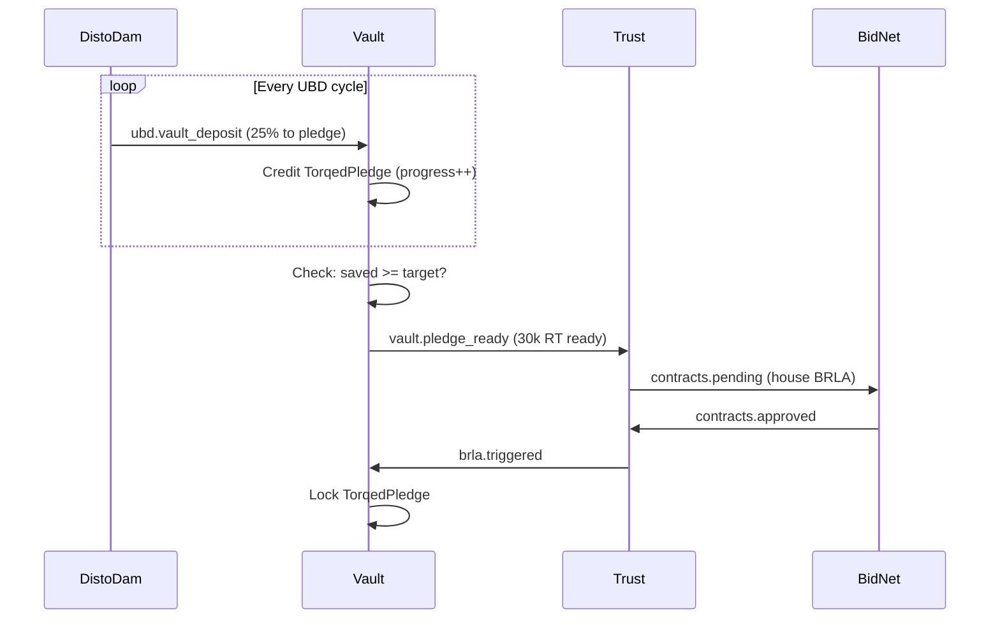
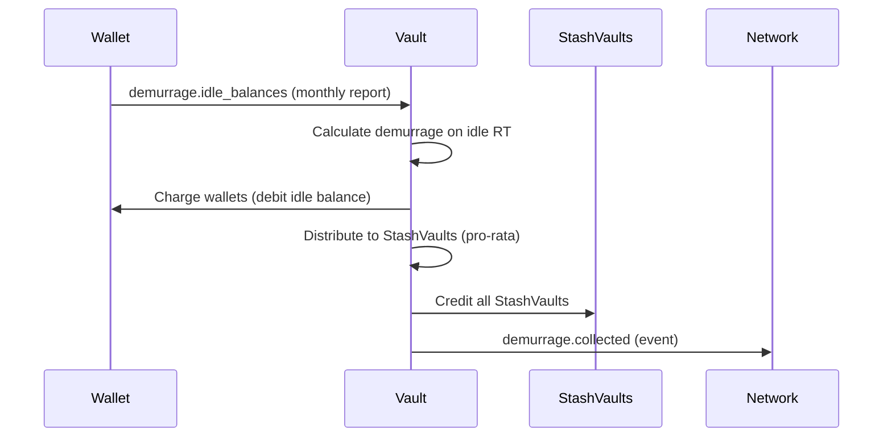

# Vault Service - Architecture & Overview

## 📋 **Document Metadata**
- **Service**: Vault (Savings & Investment Gateway)
- **Version**: v0.1.0 (MVP)
- **Author**: Jonathan Clark (@GrokkingGrok)
- **Date**: November 14, 2025
- **Status**: Planning Phase
- **Dependencies**: DistoDam (UBD diversions), Wallet (manual transfers), Trust (BRLA triggers)

---

## 🎯 **Service Mission**

The Vault Service is the **savings and investment layer** of the RoboTorq network, providing:

1. **Demurrage Protection**: Shield idle RT from storage costs
2. **Yield Generation**: Earn returns on saved RT (demurrage pool + base yields)
3. **Deferred Consumption**: Save for big purchases (TorqedPledges)
4. **Investment Facilitation**: Fund BidNet projects (DistoFunnels - future)
5. **Automated Savings**: Pre-wallet UBD diversions configured through DistoDam

---

## 🏛️ **Strategic Position in RoboTorq Network**

### **The Core Problem Vault Solves**:

**Without Vaults**:
```
DistoDam → Wallet → Idle RT → Demurrage → Value Loss
                              ↓
                        User loses money for saving
```

**With Vaults**:
```
DistoDam → Vault (StashVault) → Yield → User earns money for saving
         ↓
         → Wallet → Spending balance (protected)
```

### **Vault vs. Wallet**:

| Service | Purpose | RT State | Demurrage |
|---------|---------|----------|-----------|
| **Wallet** | Spending interface | Liquid, spendable | ❌ Exposed (unless vaulted) |
| **Vault** | Savings/investment | Locked, earning yield | ✅ Protected |

**Key Insight**: Vault is **not a wallet**. It's a **financial instrument service** that manages:
- StashVaults (savings accounts)
- TorqedPledges (deferred consumption savings)
- DistoFunnels (investment pledges - future)

---

## 📊 **Three Vault Types**

### **1. StashVault** (Appendix S.8)
**Purpose**: Low-risk savings with instant liquidity

| Property | Value |
|----------|-------|
| **Risk** | Low |
| **Yield** | 0.5%/month base + demurrage pool share |
| **Access** | Instant (≤ 1 block) |
| **Lock** | None |
| **Use Case** | Emergency fund, furniture, everyday savings |

**Key Feature**: Receives **100% of network-wide demurrage** redistributed pro-rata to all StashVault holders.

---

### **2. TorqedPledge (TorqedVault)** (Appendix S.9)
**Purpose**: Save for big-ticket purchases (house, car, robot fleet)

| Property | Value |
|----------|-------|
| **Risk** | Medium |
| **Yield** | 1.2%-2.0%/month (based on lock duration) |
| **Access** | Locked until purchase trigger (BRLA activation) |
| **Lock** | Until target reached + BRLA completes |
| **Use Case** | Down-payment on house, car, production equipment |

**Key Feature**: Pledges **future DistoStream %** to accumulate RT, then triggers BRLA when target reached.

**Critical Distinction**: TorqedPledge = "I'm saving MY future UBD to buy a house for MYSELF"

---

### **3. DistoFunnel (Investment Vault)** (Future - Appendix W)
**Purpose**: Invest in BidNet-approved projects for ROI

| Property | Value |
|----------|-------|
| **Risk** | Variable (based on project) |
| **Yield** | ROI-based (10%-20%+ expected) |
| **Access** | Locked until project completion |
| **Lock** | BRLA duration (weeks to months) |
| **Use Case** | Fund someone else's production, earn returns |

**Key Feature**: Pledges RT to **fund other builders' BRLAs**, receives ROI when project completes.

**Critical Distinction**: DistoFunnel = "I'm pledging MY future UBD to fund SOMEONE ELSE'S project via BidNet"

**MVP Status**: ❌ Out of scope (Phase 2 - requires BidNet integration)

---

## 🏗️ **Component Architecture**

### **Design Principles**:
1. **Modular Components**: Following Mint/BidNet/DistoDam pattern
2. **Single Responsibility**: Each component does ONE thing
3. **NATS-Centric**: Pub/sub for all inter-service communication
4. **Database-Backed**: PostgreSQL for vault state persistence
5. **Micro-RT Precision**: 1 RT = 1,000,000 µRT (avoid floating-point errors)
6. **Idempotent**: Handle duplicate events gracefully

---

### **Component Overview**:

```
┌─────────────────────────────────────────────────────────────┐
│                    Vault Service                             │
├─────────────────────────────────────────────────────────────┤
│                                                              │
│  ┌──────────┐  ┌──────────────┐  ┌──────────────────┐      │
│  │  Config  │  │ StashVault   │  │ TorqedPledge     │      │
│  │          │  │ Manager      │  │ Manager          │      │
│  └──────────┘  └──────────────┘  └──────────────────┘      │
│                                                              │
│  ┌──────────────┐  ┌───────────────┐  ┌────────────┐       │
│  │ Demurrage    │  │ Yield         │  │ Vault      │       │
│  │ Calculator   │  │ Distributor   │  │ Repository │       │
│  └──────────────┘  └───────────────┘  └────────────┘       │
│                                                              │
│  ┌──────────┐  ┌──────────────────┐                        │
│  │ API      │  │ Metrics          │                        │
│  │ Server   │  │ Collector        │                        │
│  └──────────┘  └──────────────────┘                        │
│                                                              │
└─────────────────────────────────────────────────────────────┘
         │                    │                    │
         ▼                    ▼                    ▼
    PostgreSQL              NATS              Prometheus
```

---

### **1. Config**
**Responsibility**: Load and validate configuration from environment

**Environment Variables**:
```bash
# HTTP server
HTTP_PORT=3002              # Default: "3002" (avoid conflicts)

# NATS connection
NATS_URL=nats://nats:4222   # Default: "nats://nats:4222"

# NATS topics (configurable for testing)
UBD_VAULT_DEPOSIT_TOPIC=ubd.vault_deposit       # Input from DistoDam
WALLET_VAULT_TRANSFER_TOPIC=wallet.vault_transfer # Input from Wallet
DEMURRAGE_IDLE_TOPIC=demurrage.idle_balances     # Input from Wallet
BRLA_TRIGGERED_TOPIC=brla.triggered              # Input from Trust
VAULT_DEPOSITED_TOPIC=vault.deposited            # Output confirmation
VAULT_WITHDRAWN_TOPIC=vault.withdrawn            # Output confirmation
VAULT_PLEDGE_READY_TOPIC=vault.pledge_ready      # Output to Trust
DEMURRAGE_COLLECTED_TOPIC=demurrage.collected    # Output to network

# Database connection
DB_HOST=postgres            # Default: "postgres"
DB_PORT=5432                # Default: "5432"
DB_NAME=vault_db            # Default: "vault_db"
DB_USER=vault               # Default: "vault"
DB_PASSWORD=vault_pass      # Default: "vault_pass"
DB_SSL_MODE=disable         # Default: "disable" (use "require" in production)

# Vault configuration
STASH_BASE_YIELD_BPS=50     # 0.5% per month = 50 basis points
TORQED_MIN_YIELD_BPS=120    # 1.2% per month minimum
TORQED_MAX_YIELD_BPS=200    # 2.0% per month maximum
DEMURRAGE_RATE_BPS=100      # 1% per month demurrage on idle RT
MIN_STASH_DEPOSIT_RT=0.01   # Minimum StashVault deposit
MIN_PLEDGE_TARGET_RT=1.0    # Minimum TorqedPledge target

# Metrics & monitoring
METRICS_ENABLED=true        # Default: "true"
METRICS_PORT=9095           # Prometheus metrics port

# Logging
LOG_LEVEL=info              # Options: debug, info, warn, error
LOG_FORMAT=json             # Options: json, text
```

**Interface**:
```go
type Config struct {
    // HTTP server
    HTTPPort string

    // NATS
    NATSURL                  string
    UBDVaultDepositTopic     string
    WalletVaultTransferTopic string
    DemurrageIdleTopic       string
    BRLATriggeredTopic       string
    VaultDepositedTopic      string
    VaultWithdrawnTopic      string
    VaultPledgeReadyTopic    string
    DemurrageCollectedTopic  string

    // Database
    DBHost     string
    DBPort     string
    DBName     string
    DBUser     string
    DBPassword string
    DBSSLMode  string

    // Vault settings
    StashBaseYieldBps   int64  // Basis points (50 = 0.5%)
    TorqedMinYieldBps   int64
    TorqedMaxYieldBps   int64
    DemurrageRateBps    int64
    MinStashDepositRT   float64
    MinPledgeTargetRT   float64

    // Metrics
    MetricsEnabled bool
    MetricsPort    string

    // Logging
    LogLevel  string
    LogFormat string
}

func LoadConfig() (*Config, error)
func (c *Config) Validate() error
func (c *Config) GetDBConnectionString() string
```

**Tests** (28 tests):
- ✅ Load from environment variables (8 tests)
- ✅ Default values when env vars missing (6 tests)
- ✅ Validation errors (8 tests)
- ✅ Database connection string generation (3 tests)
- ✅ Basis points conversion (3 tests)

---

### **2. StashVaultManager**
**Responsibility**: Manage low-risk savings vaults (instant liquidity)

See `STASHVAULT_IMPLEMENTATION.md` for full specification.

**Key Operations**:
- Create StashVault
- Deposit RT (from DistoDam or Wallet)
- Withdraw RT (instant, no penalty)
- Calculate demurrage pool share
- Distribute yields

---

### **3. TorqedPledgeManager**
**Responsibility**: Manage deferred-consumption savings (house, car, etc.)

See `TORQEDVAULT_IMPLEMENTATION.md` for full specification.

**Key Operations**:
- Create TorqedPledge (target amount, monthly pledge %)
- Accept deposits from DistoDam (auto-diversion)
- Check pledge maturity (target reached?)
- Trigger BRLA when ready
- Lock pledge during BRLA execution

---

### **4. DemurrageCalculator**
**Responsibility**: Calculate demurrage on idle RT, redistribute to StashVaults

**Demurrage Model**:
```
Demurrage = idle_balance × demurrage_rate × time_elapsed

Where:
- idle_balance = RT in Wallet (not in any vault)
- demurrage_rate = 1% per month (configurable)
- time_elapsed = seconds since last activity
```

**Distribution**:
```
StashVault_share = (StashVault_balance / Total_StashVault_balance) × Total_Demurrage
```

**Interface**:
```go
type DemurrageCalculator interface {
    // Calculate demurrage on idle balances
    CalculateDemurrage(ctx context.Context, idleBalances []*IdleBalance) (*DemurrageEvent, error)
    
    // Distribute demurrage to StashVaults
    DistributeToStashVaults(ctx context.Context, totalDemurrage int64) error
    
    // Get demurrage statistics
    GetStats() DemurrageStats
}

type IdleBalance struct {
    WalletID        string
    BalanceMicroRT  int64
    LastActivityAt  time.Time
}

type DemurrageEvent struct {
    ID                 string
    TotalDemurrageMicroRT int64
    AffectedWallets    int
    CollectedAt        time.Time
}

type DemurrageStats struct {
    TotalCollected      int64
    TotalDistributed    int64
    LastDistributionAt  time.Time
}
```

**Tests** (20 tests):
- ✅ Calculate demurrage on single wallet (4 tests)
- ✅ Calculate demurrage on multiple wallets (4 tests)
- ✅ Distribute to StashVaults pro-rata (5 tests)
- ✅ Handle zero demurrage (2 tests)
- ✅ Handle zero StashVaults (2 tests)
- ✅ Time-based calculations (3 tests)

---

### **5. YieldDistributor**
**Responsibility**: Distribute yields to vault holders

**Yield Sources**:
1. **Demurrage Pool**: 100% of network demurrage → StashVaults
2. **Base Yield**: 0.5%/month → StashVaults (from Treasury)
3. **Pledge Yield**: 1.2%-2.0%/month → TorqedPledges (from lock duration)

**Interface**:
```go
type YieldDistributor interface {
    // Distribute base yield to all StashVaults
    DistributeStashYield(ctx context.Context) error
    
    // Distribute pledge yield to active TorqedPledges
    DistributePledgeYield(ctx context.Context) error
    
    // Get yield statistics
    GetStats() YieldStats
}

type YieldStats struct {
    TotalStashYield     int64
    TotalPledgeYield    int64
    LastDistributionAt  time.Time
}
```

**Tests** (18 tests):
- ✅ Distribute StashVault base yield (5 tests)
- ✅ Distribute TorqedPledge yield (based on lock) (5 tests)
- ✅ Handle empty vaults (3 tests)
- ✅ Time-based yield calculations (5 tests)

---

### **6. VaultRepository**
**Responsibility**: Database operations for vault entities

**Interface**:
```go
type VaultRepository interface {
    // StashVault operations
    CreateStashVault(ctx context.Context, vault *StashVault) error
    GetStashVault(ctx context.Context, vaultID string) (*StashVault, error)
    UpdateStashVault(ctx context.Context, vault *StashVault) error
    ListStashVaults(ctx context.Context, limit, offset int) ([]*StashVault, error)
    GetStashVaultsByWallet(ctx context.Context, walletID string) ([]*StashVault, error)
    
    // TorqedPledge operations
    CreateTorqedPledge(ctx context.Context, pledge *TorqedPledge) error
    GetTorqedPledge(ctx context.Context, pledgeID string) (*TorqedPledge, error)
    UpdateTorqedPledge(ctx context.Context, pledge *TorqedPledge) error
    ListTorqedPledges(ctx context.Context, limit, offset int) ([]*TorqedPledge, error)
    GetTorqedPledgesByWallet(ctx context.Context, walletID string) ([]*TorqedPledge, error)
    
    // Yield operations
    LogYield(ctx context.Context, yield *VaultYield) error
    GetYieldsByVault(ctx context.Context, vaultID string, limit, offset int) ([]*VaultYield, error)
    
    // Demurrage operations
    LogDemurrageEvent(ctx context.Context, event *DemurrageEvent) error
    GetDemurrageHistory(ctx context.Context, limit, offset int) ([]*DemurrageEvent, error)
}
```

**Tests** (35 tests):
- ✅ StashVault CRUD operations (10 tests)
- ✅ TorqedPledge CRUD operations (10 tests)
- ✅ Yield logging and queries (8 tests)
- ✅ Demurrage event logging (4 tests)
- ✅ Database constraints (3 tests)

---

### **7. APIServer**
**Responsibility**: Expose HTTP endpoints for vault operations

**Endpoints**:

#### **StashVault Endpoints**:
```
POST   /api/v1/vault/stash                Create StashVault
GET    /api/v1/vault/stash/:id            Get StashVault details
POST   /api/v1/vault/stash/:id/deposit    Deposit to StashVault
POST   /api/v1/vault/stash/:id/withdraw   Withdraw from StashVault
GET    /api/v1/vault/stash/:id/yields     Get yield history
```

#### **TorqedPledge Endpoints**:
```
POST   /api/v1/vault/pledge               Create TorqedPledge
GET    /api/v1/vault/pledge/:id           Get pledge details
GET    /api/v1/vault/pledge/:id/progress  Get pledge progress
POST   /api/v1/vault/pledge/:id/deposit   Manual deposit to pledge
```

#### **Wallet Integration Endpoints**:
```
GET    /api/v1/wallet/:wallet_id/vaults   List all vaults for wallet
GET    /api/v1/wallet/:wallet_id/yields   Get all yields for wallet
```

#### **Network Endpoints**:
```
GET    /api/v1/demurrage/stats            Get demurrage statistics
GET    /api/v1/yields/stats               Get yield statistics
```

#### **Health & Metrics**:
```
GET    /health                            Health check
GET    /metrics                           Prometheus metrics
```

**Tests** (32 tests):
- ✅ StashVault endpoints (10 tests)
- ✅ TorqedPledge endpoints (10 tests)
- ✅ Wallet integration endpoints (6 tests)
- ✅ Network stats endpoints (3 tests)
- ✅ Error handling (3 tests)

---

### **8. MetricsCollector**
**Responsibility**: Expose Prometheus metrics for monitoring

**Metrics**:
```go
// StashVault metrics
stash_vaults_total                   // Gauge: Total StashVaults
stash_vault_balance_rt               // Gauge: Balance per vault (labeled by vault_id)
stash_vault_deposits_total           // Counter: Total deposits
stash_vault_withdrawals_total        // Counter: Total withdrawals

// TorqedPledge metrics
torqed_pledges_total                 // Gauge: Total active pledges
torqed_pledge_progress_pct           // Gauge: Pledge progress % (labeled by pledge_id)
torqed_pledges_matured_total         // Counter: Pledges that reached target
torqed_pledges_triggered_total       // Counter: BRLAs triggered by pledges

// Demurrage metrics
demurrage_collected_rt_total         // Counter: Total demurrage collected
demurrage_distributed_rt_total       // Counter: Total demurrage distributed
demurrage_calculation_duration_seconds // Histogram: Calculation time

// Yield metrics
yields_distributed_rt_total          // Counter: Total yields (labeled by type)
yield_distribution_duration_seconds  // Histogram: Distribution time

// API metrics
http_requests_total                  // Counter: HTTP requests (labeled by endpoint, method, status)
http_request_duration_seconds        // Histogram: Request duration
```

**Tests** (12 tests):
- ✅ Metrics registration (3 tests)
- ✅ Counter increments (3 tests)
- ✅ Gauge updates (3 tests)
- ✅ Histogram observations (3 tests)

---

## 🗄️ **Database Schema**

### **Technology**: PostgreSQL 15+

### **Schema Overview**:

```sql
-- StashVaults table
CREATE TABLE stash_vaults (
    id                VARCHAR(64) PRIMARY KEY,        -- "stash-{uuid}"
    wallet_id         VARCHAR(64) NOT NULL,           -- Owner wallet
    balance_micro_rt  BIGINT NOT NULL DEFAULT 0,      -- Current balance
    total_deposited_micro_rt BIGINT NOT NULL DEFAULT 0, -- Lifetime deposits
    total_withdrawn_micro_rt BIGINT NOT NULL DEFAULT 0, -- Lifetime withdrawals
    last_yield_at     TIMESTAMP NOT NULL DEFAULT NOW(), -- Last yield distribution
    created_at        TIMESTAMP NOT NULL DEFAULT NOW(),
    updated_at        TIMESTAMP NOT NULL DEFAULT NOW(),
    
    CONSTRAINT balance_non_negative CHECK (balance_micro_rt >= 0)
);

CREATE INDEX idx_stash_vaults_wallet_id ON stash_vaults(wallet_id);
CREATE INDEX idx_stash_vaults_balance ON stash_vaults(balance_micro_rt DESC);

-- TorqedPledges table
CREATE TABLE torqed_pledges (
    id                      VARCHAR(64) PRIMARY KEY,  -- "pledge-{uuid}"
    wallet_id               VARCHAR(64) NOT NULL,     -- Owner wallet
    target_micro_rt         BIGINT NOT NULL,          -- Goal amount
    saved_micro_rt          BIGINT NOT NULL DEFAULT 0, -- Current progress
    monthly_pledge_micro_rt BIGINT NOT NULL,          -- Monthly UBD diversion
    brla_id                 VARCHAR(64),              -- Linked BRLA (when triggered)
    reputation_score        INTEGER NOT NULL DEFAULT 50, -- 0-100
    status                  VARCHAR(20) NOT NULL DEFAULT 'active',
    lock_duration_months    INTEGER NOT NULL DEFAULT 24, -- Lock calculation
    maturity_at             TIMESTAMP,                -- When target reached
    triggered_at            TIMESTAMP,                -- When BRLA started
    completed_at            TIMESTAMP,                -- When BRLA finished
    created_at              TIMESTAMP NOT NULL DEFAULT NOW(),
    updated_at              TIMESTAMP NOT NULL DEFAULT NOW(),
    
    CONSTRAINT valid_status CHECK (status IN ('active', 'matured', 'triggered', 'completed', 'defaulted')),
    CONSTRAINT valid_reputation CHECK (reputation_score >= 0 AND reputation_score <= 100),
    CONSTRAINT saved_lte_target CHECK (saved_micro_rt <= target_micro_rt)
);

CREATE INDEX idx_torqed_pledges_wallet_id ON torqed_pledges(wallet_id);
CREATE INDEX idx_torqed_pledges_status ON torqed_pledges(status);
CREATE INDEX idx_torqed_pledges_maturity ON torqed_pledges(maturity_at);

-- Vault yields table
CREATE TABLE vault_yields (
    id              VARCHAR(64) PRIMARY KEY,          -- "yield-{uuid}"
    vault_id        VARCHAR(64) NOT NULL,             -- StashVault or TorqedPledge ID
    vault_type      VARCHAR(20) NOT NULL,             -- 'stash' or 'torqed'
    amount_micro_rt BIGINT NOT NULL,                  -- Yield amount
    yield_type      VARCHAR(30) NOT NULL,             -- 'demurrage_pool', 'base_yield', 'pledge_yield'
    earned_at       TIMESTAMP NOT NULL DEFAULT NOW(),
    
    CONSTRAINT valid_vault_type CHECK (vault_type IN ('stash', 'torqed')),
    CONSTRAINT valid_yield_type CHECK (yield_type IN ('demurrage_pool', 'base_yield', 'pledge_yield'))
);

CREATE INDEX idx_vault_yields_vault_id ON vault_yields(vault_id);
CREATE INDEX idx_vault_yields_earned_at ON vault_yields(earned_at DESC);

-- Demurrage events table
CREATE TABLE demurrage_events (
    id                      VARCHAR(64) PRIMARY KEY,  -- "demurrage-{uuid}"
    total_collected_micro_rt BIGINT NOT NULL,         -- Total demurrage collected
    affected_wallets        INTEGER NOT NULL,          -- Number of wallets charged
    distributed_micro_rt    BIGINT NOT NULL,          -- Amount distributed to StashVaults
    stash_vault_count       INTEGER NOT NULL,         -- Number of StashVaults receiving
    collected_at            TIMESTAMP NOT NULL DEFAULT NOW(),
    
    CONSTRAINT collected_equals_distributed CHECK (total_collected_micro_rt = distributed_micro_rt)
);

CREATE INDEX idx_demurrage_events_collected_at ON demurrage_events(collected_at DESC);
```

**Migration Strategy**:
- Use `golang-migrate/migrate` for schema migrations
- Versioned SQL files: `000001_create_stash_vaults.up.sql`, etc.
- Rollback support: `*.down.sql` files

---

## 📡 **NATS Topics & Message Schemas**

### **Subscribed Topics** (Input):

#### **1. `ubd.vault_deposit`** (from DistoDam)
**Purpose**: Auto-divert UBD to vault (configured savings plan)

**Message Schema**:
```go
type UBDVaultDeposit struct {
    WalletID       string    `json:"wallet_id"`
    VaultType      string    `json:"vault_type"`      // "stash" or "torqed"
    VaultID        string    `json:"vault_id"`        // Existing vault ID or "new"
    Amount         float64   `json:"amount"`          // RT to deposit
    SourceEventID  string    `json:"source_event_id"` // Idempotency key
    DepositedAt    time.Time `json:"deposited_at"`
}
```

---

#### **2. `wallet.vault_transfer`** (from Wallet)
**Purpose**: Manual vault deposit/withdrawal from wallet balance

**Message Schema**:
```go
type WalletVaultTransfer struct {
    TransferID     string    `json:"transfer_id"`     // UUID
    WalletID       string    `json:"wallet_id"`
    VaultType      string    `json:"vault_type"`      // "stash" or "torqed"
    VaultID        string    `json:"vault_id"`
    Direction      string    `json:"direction"`       // "deposit" or "withdraw"
    Amount         float64   `json:"amount"`          // RT amount
    TransferredAt  time.Time `json:"transferred_at"`
}
```

---

#### **3. `demurrage.idle_balances`** (from Wallet)
**Purpose**: Report idle wallet balances for demurrage calculation

**Message Schema**:
```go
type IdleBalancesReport struct {
    ReportID       string          `json:"report_id"`
    IdleBalances   []IdleBalance   `json:"idle_balances"`
    ReportedAt     time.Time       `json:"reported_at"`
}

type IdleBalance struct {
    WalletID        string    `json:"wallet_id"`
    BalanceMicroRT  int64     `json:"balance_micro_rt"`
    LastActivityAt  time.Time `json:"last_activity_at"`
}
```

---

#### **4. `brla.triggered`** (from Trust - future)
**Purpose**: Notify that BRLA has started, lock TorqedPledge

**Message Schema**:
```go
type BRLATriggered struct {
    BRLAID         string    `json:"brla_id"`
    PledgeID       string    `json:"pledge_id"`        // TorqedPledge that triggered it
    ContractID     string    `json:"contract_id"`
    TriggeredAt    time.Time `json:"triggered_at"`
}
```

---

### **Published Topics** (Output):

#### **5. `vault.deposited`** (to Wallet/DistoDam)
**Purpose**: Confirm vault deposit succeeded

**Message Schema**:
```go
type VaultDeposited struct {
    VaultID        string    `json:"vault_id"`
    VaultType      string    `json:"vault_type"`
    WalletID       string    `json:"wallet_id"`
    Amount         float64   `json:"amount"`
    NewBalance     float64   `json:"new_balance"`
    DepositedAt    time.Time `json:"deposited_at"`
}
```

---

#### **6. `vault.withdrawn`** (to Wallet)
**Purpose**: Confirm vault withdrawal succeeded

**Message Schema**:
```go
type VaultWithdrawn struct {
    VaultID        string    `json:"vault_id"`
    VaultType      string    `json:"vault_type"`
    WalletID       string    `json:"wallet_id"`
    Amount         float64   `json:"amount"`
    NewBalance     float64   `json:"new_balance"`
    WithdrawnAt    time.Time `json:"withdrawn_at"`
}
```

---

#### **7. `vault.pledge_ready`** (to Trust)
**Purpose**: TorqedPledge reached target, ready to trigger BRLA

**Message Schema**:
```go
type PledgeReady struct {
    PledgeID       string    `json:"pledge_id"`
    WalletID       string    `json:"wallet_id"`
    TargetAmount   float64   `json:"target_amount"`
    SavedAmount    float64   `json:"saved_amount"`
    Purpose        string    `json:"purpose"`          // "house", "car", etc.
    MaturedAt      time.Time `json:"matured_at"`
}
```

---

#### **8. `demurrage.collected`** (to network)
**Purpose**: Announce demurrage collection and distribution

**Message Schema**:
```go
type DemurrageCollected struct {
    EventID            string    `json:"event_id"`
    TotalCollected     float64   `json:"total_collected"`
    AffectedWallets    int       `json:"affected_wallets"`
    DistributedToVaults float64  `json:"distributed_to_vaults"`
    StashVaultCount    int       `json:"stash_vault_count"`
    CollectedAt        time.Time `json:"collected_at"`
}
```

---

## 🔄 **Data Flow Examples**

### **Example 1: UBD Auto-Save to StashVault**



---

### **Example 2: Manual Vault Deposit from Wallet**



---

### **Example 3: TorqedPledge Maturation & BRLA Trigger**



---

### **Example 4: Demurrage Collection & Distribution**



---

## 🧪 **Testing Strategy**

### **Test Coverage Target**: 95%+

### **Unit Tests** (145+ tests):
- ✅ **Config**: 28 tests
- ✅ **StashVaultManager**: 25 tests (see STASHVAULT_IMPLEMENTATION.md)
- ✅ **TorqedPledgeManager**: 30 tests (see TORQEDVAULT_IMPLEMENTATION.md)
- ✅ **DemurrageCalculator**: 20 tests
- ✅ **YieldDistributor**: 18 tests
- ✅ **VaultRepository**: 35 tests
- ✅ **APIServer**: 32 tests
- ✅ **MetricsCollector**: 12 tests

### **Integration Tests** (Embedded NATS + PostgreSQL):

**Scenario 1: UBD Auto-Save Flow**
```go
func TestVaultIntegration_UBDAutoSave(t *testing.T) {
    // Setup: NATS + PostgreSQL
    natsServer := natstest.RunServer(t)
    db := testdb.SetupPostgres(t)
    defer natsServer.Shutdown()
    defer db.Close()
    
    // Create Vault service
    vault := NewVaultService(config, db, natsServer.ClientURL())
    vault.Start()
    defer vault.Stop()
    
    // Simulate DistoDam publishing UBD vault deposit
    natsClient := nats.Connect(natsServer.ClientURL())
    event := UBDVaultDeposit{
        WalletID:  "wallet-test",
        VaultType: "stash",
        VaultID:   "new",
        Amount:    10.0,
    }
    natsClient.PublishJSON("ubd.vault_deposit", event)
    
    // Wait for processing
    time.Sleep(100 * time.Millisecond)
    
    // Verify StashVault created and funded
    vaults, _ := vault.GetStashVaultsByWallet(ctx, "wallet-test")
    assert.Len(t, vaults, 1)
    assert.Equal(t, 10.0, vaults[0].Balance)
}
```

**Scenario 2: TorqedPledge Maturation**
**Scenario 3: Demurrage Collection & Distribution**
**Scenario 4: Manual Vault Transfer from Wallet**
**Scenario 5: BRLA Trigger & Pledge Lock**

### **E2E Test Script** (PowerShell):
```powershell
# test-vault-e2e.ps1
Write-Host "=== Vault E2E Test ===" -ForegroundColor Green

# 1. Create StashVault
$vault = Invoke-RestMethod -Uri "http://localhost:3002/api/v1/vault/stash" `
    -Method POST -Body '{"wallet_id":"wallet-1"}'
Write-Host "✅ StashVault created: $($vault.id)"

# 2. Deposit to StashVault
Invoke-RestMethod -Uri "http://localhost:3002/api/v1/vault/stash/$($vault.id)/deposit" `
    -Method POST -Body '{"amount":50.0}'
Write-Host "✅ Deposited 50 RT"

# 3. Check balance
$balance = Invoke-RestMethod -Uri "http://localhost:3002/api/v1/vault/stash/$($vault.id)"
assert($balance.balance -eq 50.0)
Write-Host "✅ Balance: 50 RT"

# 4. Create TorqedPledge
$pledge = Invoke-RestMethod -Uri "http://localhost:3002/api/v1/vault/pledge" `
    -Method POST -Body '{"wallet_id":"wallet-1","target_amount":1000.0,"monthly_pledge":25.0}'
Write-Host "✅ TorqedPledge created: $($pledge.id)"

# 5. Simulate UBD deposits
for ($i = 1; $i -le 40; $i++) {
    docker exec robotorq-nats nats pub ubd.vault_deposit "{\"wallet_id\":\"wallet-1\",\"vault_type\":\"torqed\",\"vault_id\":\"$($pledge.id)\",\"amount\":25.0}"
    Start-Sleep -Milliseconds 100
}

# 6. Check pledge progress
$progress = Invoke-RestMethod -Uri "http://localhost:3002/api/v1/vault/pledge/$($pledge.id)/progress"
assert($progress.progress_pct -eq 100.0)
Write-Host "✅ Pledge matured: 100%"

Write-Host "`n=== All E2E tests passed! ===" -ForegroundColor Green
```

---

## 🐳 **Docker Deployment**

### **Dockerfile** (Multi-stage build):
```dockerfile
# Stage 1: Build stage
FROM golang:1.24-alpine AS builder

WORKDIR /app

# Install dependencies
RUN apk add --no-cache git

# Copy go.mod and go.sum
COPY go.mod go.sum ./
RUN go mod download

# Copy source code
COPY . .

# Build binary
RUN CGO_ENABLED=0 GOOS=linux go build -a -installsuffix cgo -o vault ./cmd/vault

# Stage 2: Runtime stage
FROM alpine:latest

RUN apk --no-cache add ca-certificates

WORKDIR /root/

# Copy binary from builder
COPY --from=builder /app/vault .

# Expose HTTP and metrics ports
EXPOSE 3002 9095

# Health check
HEALTHCHECK --interval=30s --timeout=3s --start-period=5s --retries=3 \
    CMD wget --no-verbose --tries=1 --spider http://localhost:3002/health || exit 1

CMD ["./vault"]
```

### **docker-compose.yaml** (Integration):
```yaml
version: '3.8'

services:
  vault:
    build:
      context: ./src/vault
      dockerfile: Dockerfile
    container_name: robotorq-vault
    ports:
      - "3002:3002"  # HTTP API
      - "9095:9095"  # Prometheus metrics
    environment:
      HTTP_PORT: "3002"
      NATS_URL: "nats://nats:4222"
      DB_HOST: "postgres"
      DB_PORT: "5432"
      DB_NAME: "vault_db"
      DB_USER: "vault"
      DB_PASSWORD: "vault_pass"
      DB_SSL_MODE: "disable"
      LOG_LEVEL: "info"
      METRICS_ENABLED: "true"
    depends_on:
      - nats
      - postgres
    networks:
      - robotorq
    restart: unless-stopped

  postgres:
    # Note: If wallet service also uses postgres, 
    # create separate databases on same instance
    environment:
      # Add vault_db to existing postgres setup
      POSTGRES_MULTIPLE_DATABASES: "wallet_db,vault_db"
    # ... rest of postgres config
```

---

## 📝 **Implementation Checklist**

### **Phase 1: Core Infrastructure** (Day 1-2)
- [ ] **Project scaffolding**
  - [ ] Create `src/vault/` directory structure
  - [ ] Initialize Go module: `go mod init b2b/vault`
  - [ ] Create `cmd/vault/main.go` entry point
  - [ ] Create `internal/` packages: config, stash, torqed, demurrage, yield, repository, api
  
- [ ] **Config component**
  - [ ] Implement `LoadConfig()` with environment variable parsing
  - [ ] Implement `Validate()` with comprehensive checks
  - [ ] Write 28 unit tests (all passing)
  - [ ] Document all environment variables
  
- [ ] **Database setup**
  - [ ] Create PostgreSQL schema migrations
  - [ ] Implement `VaultRepository` interface
  - [ ] Implement database connection pool
  - [ ] Write 35 repository unit tests
  - [ ] Test migrations (up/down)

- [ ] **Docker setup**
  - [ ] Create Dockerfile (multi-stage build)
  - [ ] Update docker-compose.yaml (add vault + postgres db)
  - [ ] Health check endpoint
  - [ ] Test local build: `docker-compose build vault`

### **Phase 2: StashVault Implementation** (Day 2-3)
See `STASHVAULT_IMPLEMENTATION.md` for detailed checklist.

- [ ] **StashVaultManager component**
- [ ] **DemurrageCalculator component**
- [ ] **YieldDistributor component**
- [ ] **API endpoints for StashVault**
- [ ] **Integration tests**

### **Phase 3: TorqedPledge Implementation** (Day 3-4)
See `TORQEDVAULT_IMPLEMENTATION.md` for detailed checklist.

- [ ] **TorqedPledgeManager component**
- [ ] **Pledge maturity checking**
- [ ] **BRLA trigger integration**
- [ ] **API endpoints for TorqedPledge**
- [ ] **Integration tests**

### **Phase 4: NATS Integration** (Day 4)
- [ ] **UBD vault deposit handler**
  - [ ] Subscribe to `ubd.vault_deposit`
  - [ ] Route to StashVault or TorqedPledge
  - [ ] Publish `vault.deposited` confirmation
  
- [ ] **Wallet transfer handler**
  - [ ] Subscribe to `wallet.vault_transfer`
  - [ ] Handle deposits and withdrawals
  - [ ] Publish confirmations
  
- [ ] **Demurrage handler**
  - [ ] Subscribe to `demurrage.idle_balances`
  - [ ] Calculate and distribute
  - [ ] Publish `demurrage.collected`
  
- [ ] **BRLA trigger handler** (future)
  - [ ] Subscribe to `brla.triggered`
  - [ ] Lock TorqedPledge

### **Phase 5: Metrics & Monitoring** (Day 4-5)
- [ ] **MetricsCollector**
  - [ ] Implement Prometheus metrics
  - [ ] Expose `/metrics` endpoint
  - [ ] Write 12 metrics unit tests
  
- [ ] **Observability**
  - [ ] Structured logging (zap)
  - [ ] Add trace IDs
  - [ ] Add Grafana dashboard (optional)

### **Phase 6: Testing & Documentation** (Day 5)
- [ ] **Integration tests**
  - [ ] UBD auto-save flow
  - [ ] Manual vault transfer
  - [ ] TorqedPledge maturation
  - [ ] Demurrage collection & distribution
  
- [ ] **E2E test script**
  - [ ] Create `test-vault-e2e.ps1`
  - [ ] Test all major flows
  
- [ ] **Documentation**
  - [ ] Update README
  - [ ] API documentation
  - [ ] Architecture diagrams

---

## 🔮 **Future Phases**

### **Phase 2: DistoFunnel (Investment Pledges)**
- [ ] DistoFunnelManager component
- [ ] BidNet integration (pledge RT to projects)
- [ ] ROI tracking and distribution
- [ ] Investment reputation system

### **Phase 3: Enterprise Vaults** (Appendix T)
- [ ] StashBridge (short-term working capital)
- [ ] TorqedBridge (long-term capex financing)
- [ ] Milestone-based escrow
- [ ] Collateral liquidation

### **Phase 4: Advanced Features**
- [ ] Unified Vault Slider (Appendix S.2)
- [ ] Dynamic lock duration (velocity-based)
- [ ] Anti-griefing mechanisms
- [ ] BufferPool insurance
- [ ] Multi-vault management

---

## 🎯 **Success Metrics**

### **MVP Success Criteria**:
- ✅ 95%+ test coverage
- ✅ All integration tests passing
- ✅ E2E test script passes
- ✅ HTTP API responds < 100ms (p99)
- ✅ Demurrage calculation < 1 second for 1M wallets
- ✅ Yield distribution < 2 seconds for 100K vaults
- ✅ Docker deployment successful
- ✅ Health check endpoint functional

### **Performance Targets**:
- **StashVault Operations**: 10,000 ops/sec
- **TorqedPledge Creation**: 1,000/sec
- **Demurrage Calculation**: < 1 second (1M wallets)
- **Yield Distribution**: < 2 seconds (100K vaults)

### **Reliability Targets**:
- **Uptime**: 99.9%
- **Data Integrity**: Zero balance discrepancies
- **Idempotency**: 100% duplicate event handling

---

## 🤝 **Integration Dependencies**

### **Depends On** (MVP):
1. **DistoDam**: Must publish `ubd.vault_deposit` events
2. **Wallet**: Must publish `demurrage.idle_balances` reports
3. **NATS**: Message broker (v2.12.2+)
4. **PostgreSQL**: Database (v15+)

### **Consumed By**:
1. **Wallet**: Receives `vault.deposited`, `vault.withdrawn` confirmations
2. **Trust**: Receives `vault.pledge_ready` (trigger BRLA)
3. **DistoDam**: Receives `vault.deposited` confirmation
4. **BidNet**: Future - receives investment pledges

---

## 📚 **References**

### **Related Documentation**:
- [README.md Appendix S](../../README.md#appendix-s--consumer-savings-in-torqvaults) - StashVault & TorqedPledge specs
- [README.md Appendix T](../../README.md#appendix-t--enterprise-financing-with-torqvaults) - Enterprise vault financing
- [DistoDam REFACTOR_TODO.md](../distodam/REFACTOR_TODO.md) - UBD routing source
- [Wallet IMPLEMENTATION_TODO.md](../wallet/IMPLEMENTATION_TODO.md) - Spending balance consumer
- [BidNet IMPLEMENTATION_TODO.md](../bidnet/IMPLEMENTATION_TODO.md) - Future investment integration

### **External Resources**:
- [NATS Documentation](https://docs.nats.io/)
- [PostgreSQL Documentation](https://www.postgresql.org/docs/)
- [Prometheus Metrics Best Practices](https://prometheus.io/docs/practices/naming/)

---

## ✅ **Pre-Implementation Checklist**

Before starting implementation, verify:

- [ ] README.md Appendices S & T reviewed (understand TorqVault economics)
- [ ] DistoDam REFACTOR_TODO.md reviewed (understand UBD routing)
- [ ] Wallet IMPLEMENTATION_TODO.md reviewed (understand wallet integration)
- [ ] Mint service architecture studied (component pattern reference)
- [ ] PostgreSQL experience/familiarity (database design)
- [ ] NATS pub/sub patterns understood (message handling)
- [ ] Go 1.24+ installed (`go version`)
- [ ] Docker installed (`docker --version`)

---

## 🎯 **Final Notes**

The Vault Service is the **financial backbone** of the RoboTorq network:

1. **Demurrage Protection**: Users must vault RT or lose it to storage costs
2. **Yield Generation**: Vaulting rewards responsible saving
3. **Economic Participation**: TorqedPledges enable big purchases without debt
4. **Investment Gateway**: DistoFunnels (future) fund productive BRLAs

**Architecture Principles**:
- ✅ **Single Responsibility**: Vault does savings/investment, nothing else
- ✅ **Modular**: Separate StashVault, TorqedPledge, DistoFunnel managers
- ✅ **Reusable**: Multiple consumers (DistoDam, Wallet, Trust, BidNet)
- ✅ **Scalable**: Handle millions of vaults, thousands of ops/sec
- ✅ **Testable**: 95%+ coverage, comprehensive integration tests

**Timeline**: 5 days for MVP (StashVault + TorqedPledge only, DistoFunnel in Phase 2)

**Next Steps**:
1. Review this architecture document
2. Read `STASHVAULT_IMPLEMENTATION.md` for StashVault details
3. Read `TORQEDVAULT_IMPLEMENTATION.md` for TorqedPledge details
4. Begin Phase 1 implementation (scaffolding + config + database)

---

**END OF VAULT ARCHITECTURE OVERVIEW**
